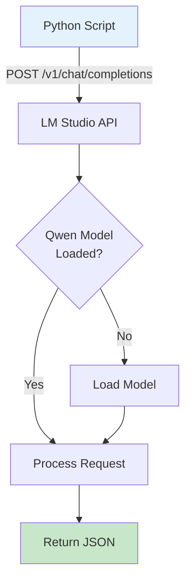
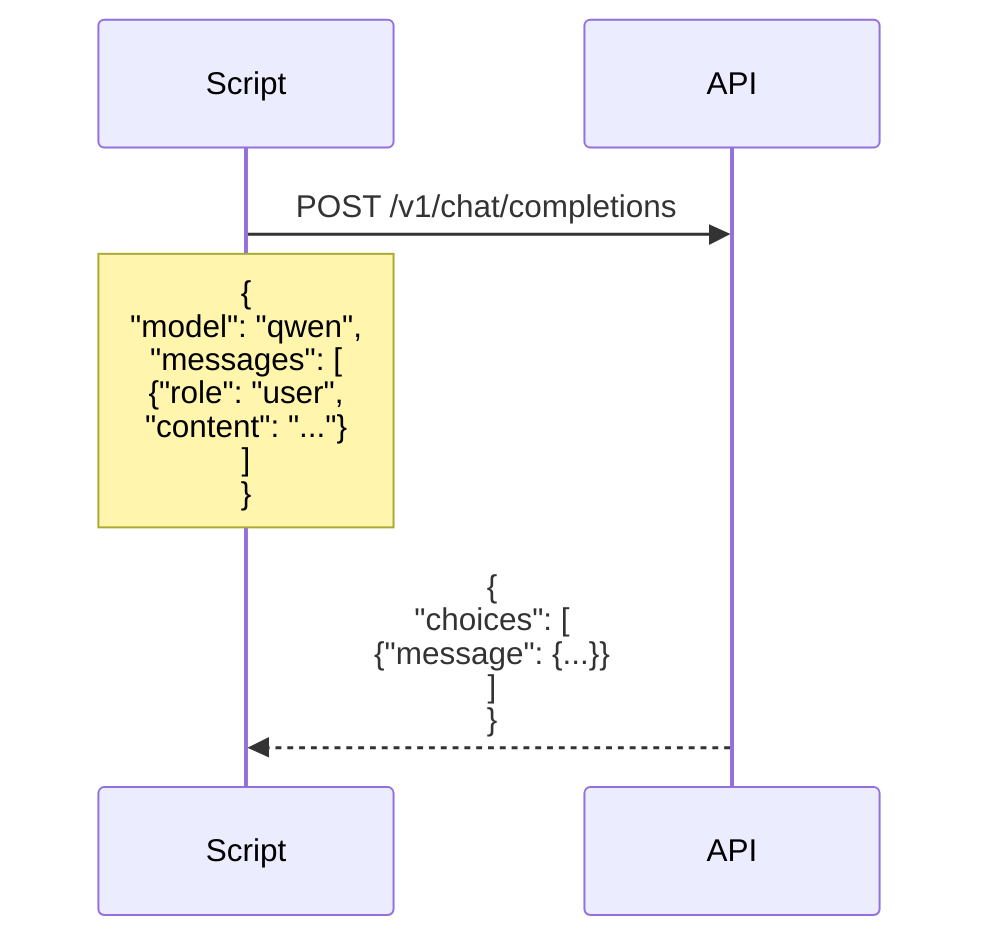
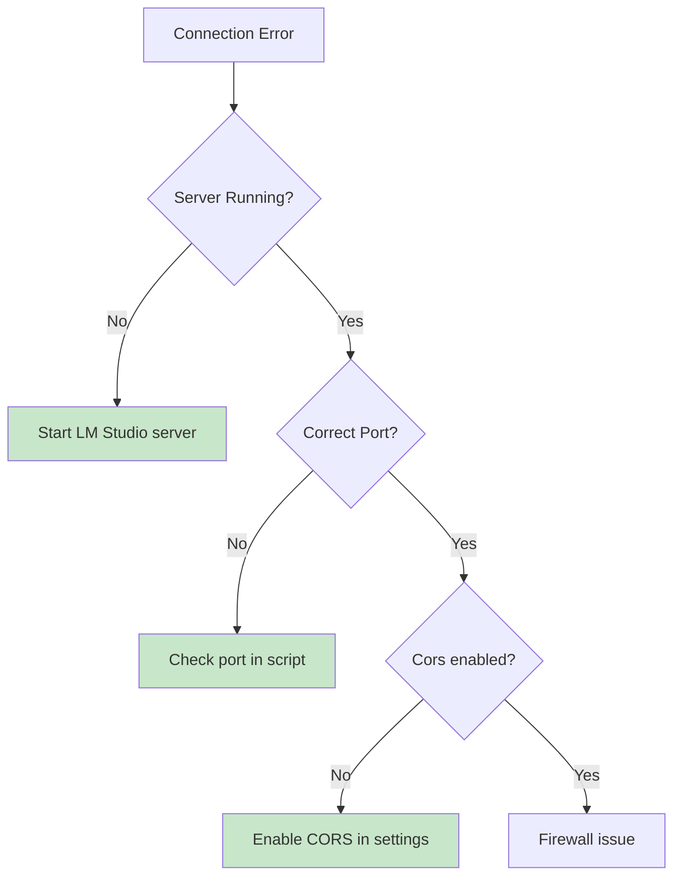

# Talk to LM Studio

Learn how to connect your scripts to LM Studio's local LLM server.

## Connection Architecture



## API Request Structure



## Setup Checklist

| Step | Task | Status |
|------|------|--------|
| 1 | Download LM Studio | ⬜ |
| 2 | Download Qwen 2.5 1.5B | ⬜ |
| 3 | Load model in UI | ⬜ |
| 4 | Click "Start Server" | ⬜ |
| 5 | Note port (default 1234) | ⬜ |
| 6 | Run script | ⬜ |

## Connection Code

```python
import requests

url = "http://localhost:1234/v1/chat/completions"
headers = {"Content-Type": "application/json"}
payload = {
    "model": "qwen2.5-1.5b",
    "messages": [
        {"role": "user", "content": "Hello!"}
    ]
}

response = requests.post(url, json=payload, headers=headers)
print(response.json()["choices"][0]["message"]["content"])
```

## Common Issues



## Configuration Options

| Setting | Default | Description |
|---------|---------|-------------|
| Port | 1234 | Server port |
| Model Name | varies | Model identifier |
| Max Tokens | 512 | Response length |
| Temperature | 0.7 | Randomness |

## Next Steps

- [ISP Classifier](../isp-classifier/index.md) - Classify customer issues
- [Qwen + RAG](../qwen-rag/index.md) - Add knowledge base