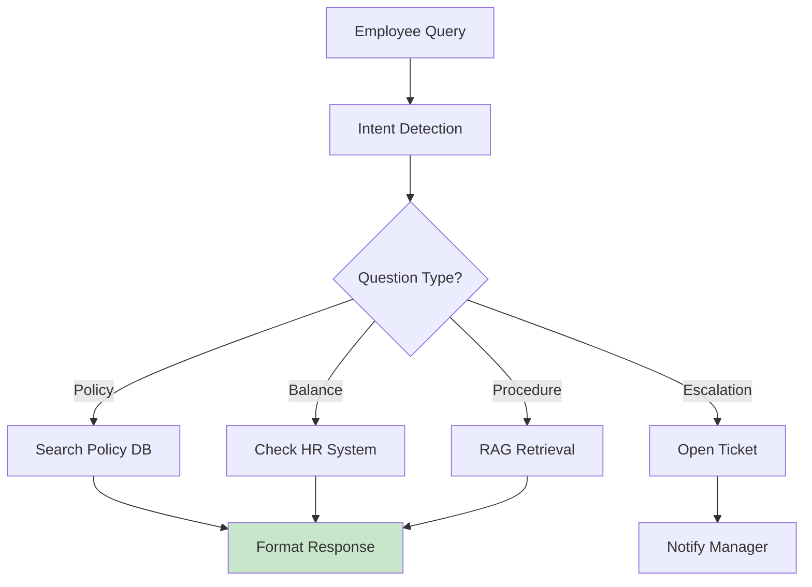
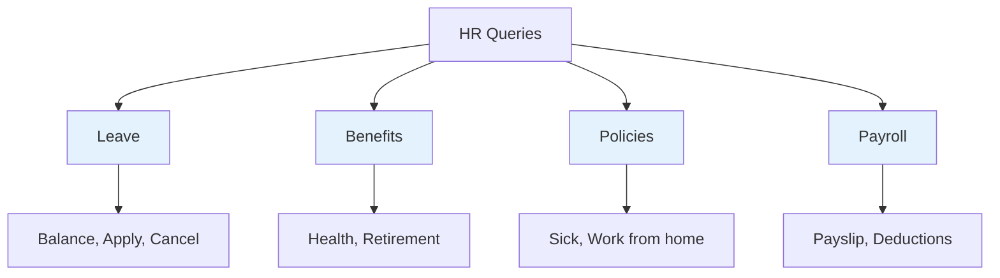
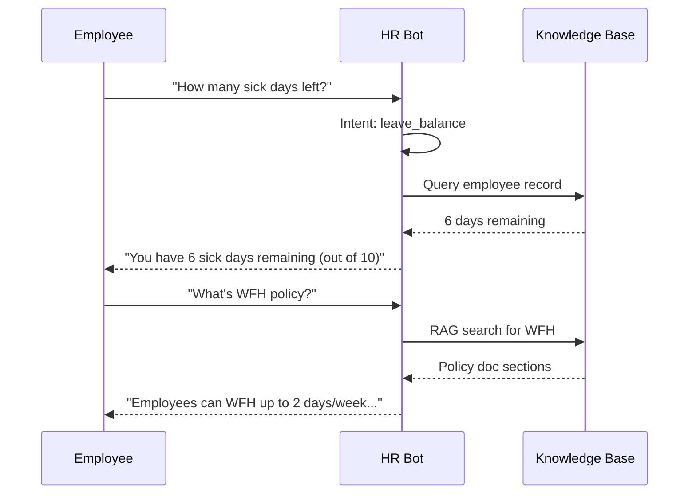
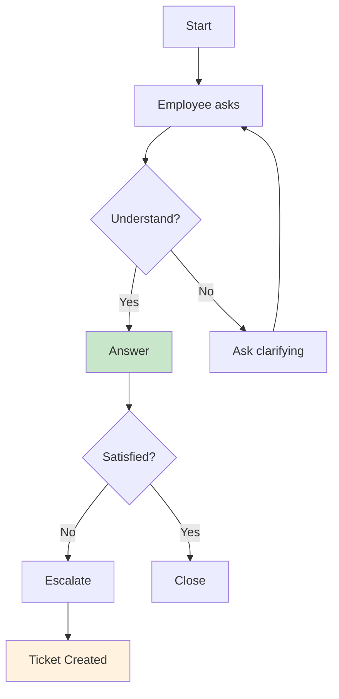

# HR Assistant

AI chatbot for employee queries with knowledge base integration.

## Assistant Architecture



## Common Query Types



## Response Flow



## Intent Classification

| Query Pattern | Intent | Response |
|---------------|--------|----------|
| "how many days" | balance | Show remaining |
| "can I take" | eligibility | Check rules |
| "what is" | policy | Retrieve doc |
| "who is" | contact | Find manager |
| "how to" | procedure | Step-by-step |

## Features

| Feature | Description |
|---------|-------------|
| 24/7 Availability | Instant responses |
| Consistent | Same answer every time |
| Escalation | Smart routing to humans |
| Learning | Improve from feedback |

## Code Pattern

```python
def hr_assistant(query, employee_id):
    intent = classify_intent(query)
    
    if intent == "balance":
        return get_leave_balance(employee_id)
    
    if intent == "policy":
        return search_policy(query)
    
    if intent == "escalation":
        return create_support_ticket(query, employee_id)
    
    return "I'm not sure, let me connect you with HR"
```

## Conversation Flow



## Next Steps

- [HR Manager](./hr-manager.md) - Leave approval
- [Enterprise Apps](../enterprise-apps/index.md) - Scale up