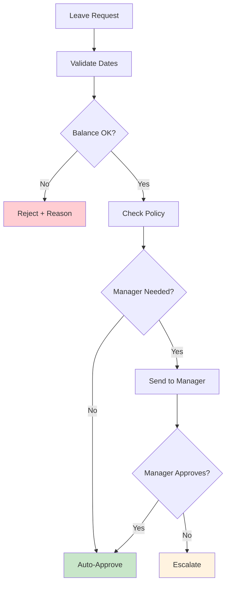
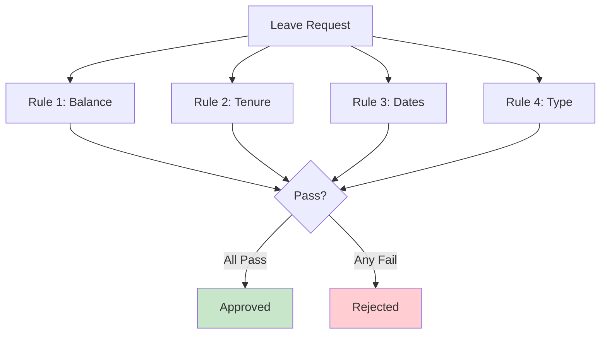
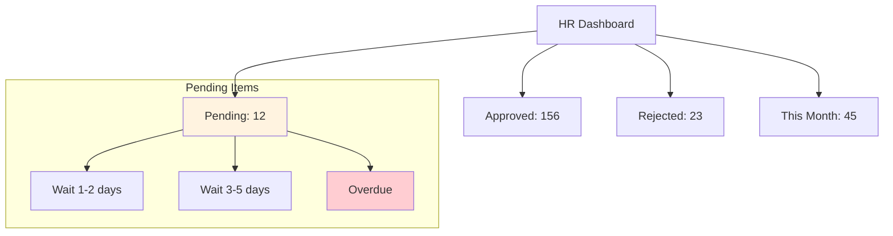
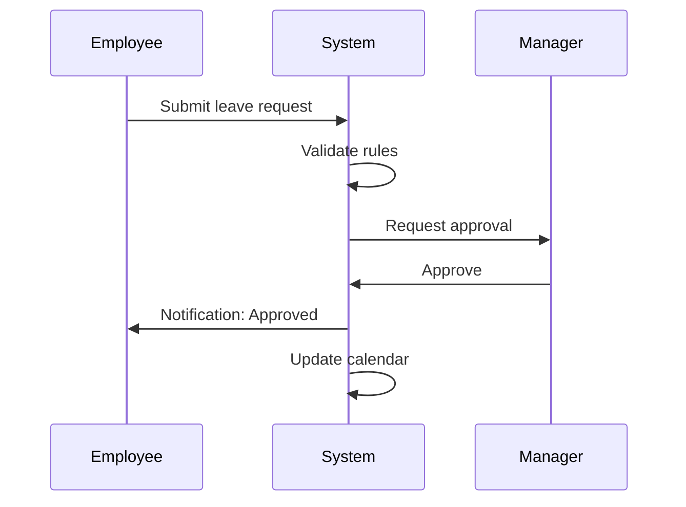

# HR Manager

Leave approval automation with policy enforcement and escalation.

## Leave Approval Flow



## Policy Rules Engine



## Leave Types

| Type | Days/Year | Advance Notice |
|------|-----------|----------------|
| Annual | 18 | 7 days |
| Sick | 10 | Same day |
| Personal | 5 | 3 days |
| Emergency | 3 | None |
| Parental | 90 | 30 days |

## Code Structure

```python
class LeaveManager:
    def approve_leave(self, employee, leave_type, dates):
        # Check rules
        if not self.check_balance(employee, leave_type):
            return Rejection("Insufficient balance")
        
        if not self.check_notice_period(dates):
            return Rejection("Insufficient notice")
        
        if self.is_blackout_period(dates):
            return Escalation("Blackout period")
        
        return Approval()
```

## Dashboard View



## Notifications



## Reporting

| Report | Purpose |
|--------|---------|
| Leave Balance | Current status |
| Utilization | Usage patterns |
| Peak Times | High demand periods |
| Cost Analysis | Leave expenses |

## Next Steps

- [HR Assistant](./hr-assistant.md) - Employee queries
- [Sales Funnel](./sales-funnel.md) - Sales automation