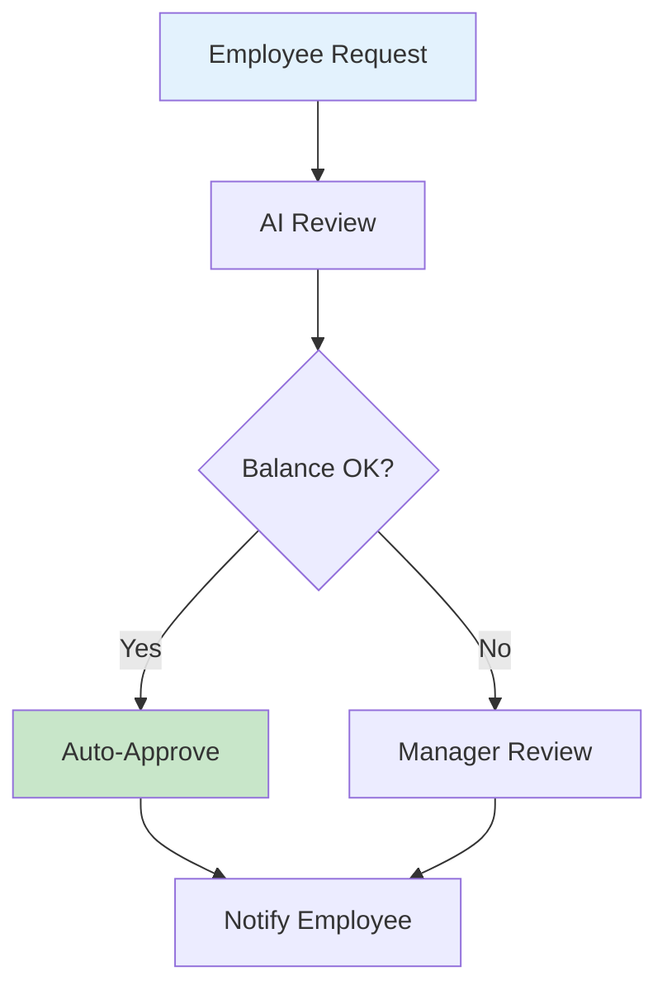
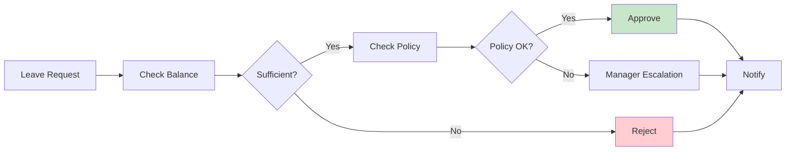
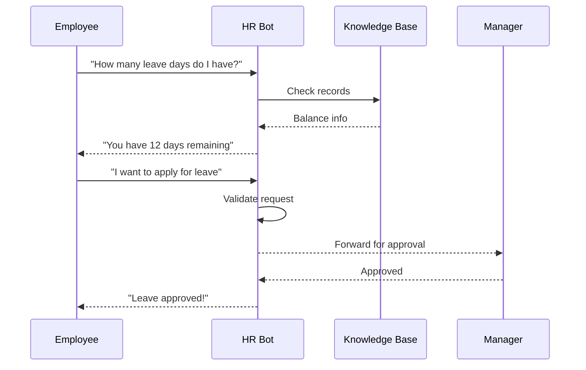
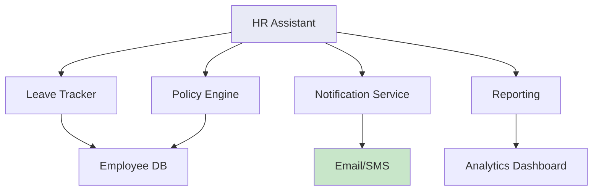

# HR Assistant

AI-powered HR automation for leave management and employee queries.

## HR Workflow



## Leave Approval Flow



## Employee Query Processing



## Features

| Feature | Description |
|---------|-------------|
| Leave Balance | Check remaining days |
| Auto-Approval | Approve valid requests |
| Policy Check | Validate against rules |
| Notifications | Email/SMS alerts |
| Reporting | Leave analytics |

## Demo Scripts

```bash
# HR Assistant (queries)
python HR_Assistant.py

# Leave Manager (approvals)
python HR_manager_Approve_leave.py
```

## System Components



## Benefits

- **24/7 Availability**: Instant responses
- **Consistency**: Applies rules uniformly
- **Efficiency**: Reduces manager workload
- **Transparency**: Clear audit trail
