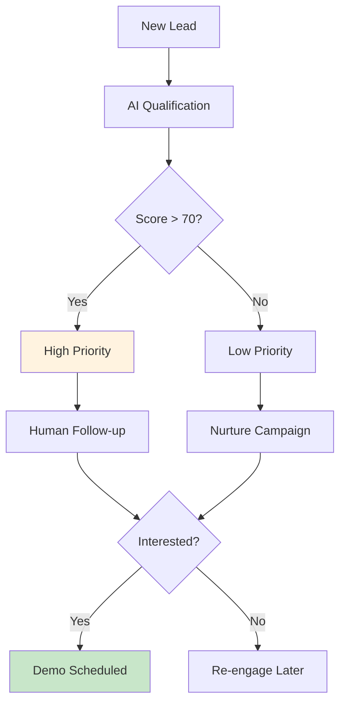
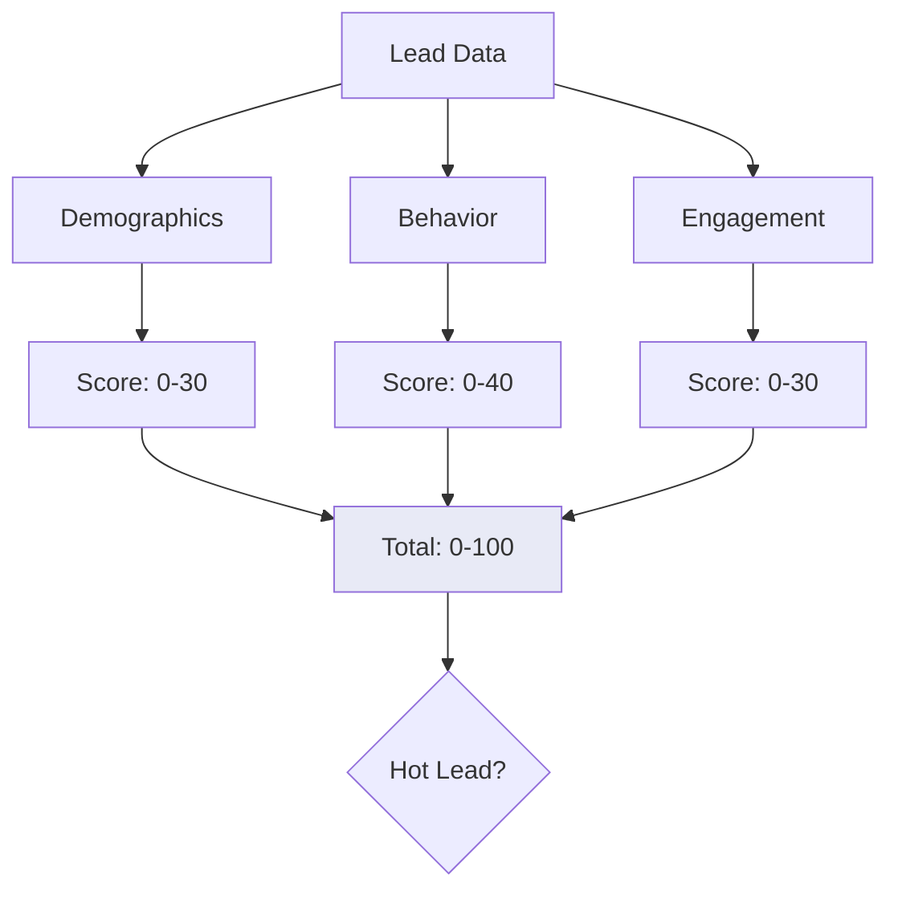
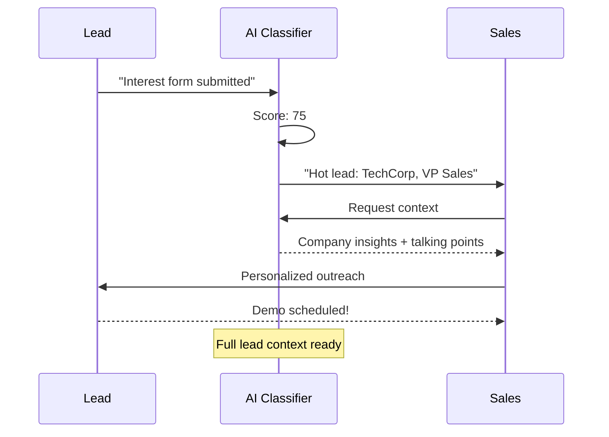
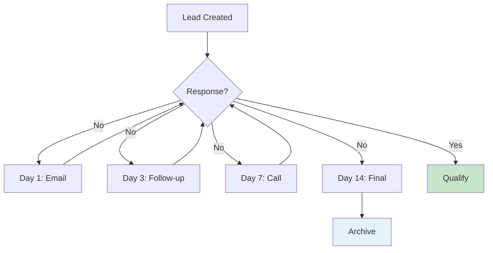

# Sales Funnel AI Closer

AI-powered sales automation for lead qualification and follow-up.

## Sales Pipeline



## Lead Scoring Model



## Scoring Factors

| Factor | Weight | Indicators |
|--------|--------|------------|
| Company Size | 20 | 50+ employees |
| Industry | 15 | Target verticals |
| Job Title | 15 | C-level, VP |
| Website Visit | 20 | Pricing page |
| Demo Request | 30 | Direct intent |
| Email Open | 10 | Campaign response |

## Qualification Flow



## AI Capabilities

| Task | Description |
|------|-------------|
| Lead Scoring | Predict conversion probability |
| Content Matching | Recommend right material |
| Email Generation | Personalized outreach |
| Follow-up Timing | Best time to contact |
| Objection Handling | Common questions answered |

## Automated Follow-up



## Demo Script

```bash
# Run sales funnel AI
python Link3_Sales_Funnel_AI_Closer.py

# Features:
# - Lead qualification
# - Personalized emails
# - Follow-up automation
```

## Metrics Dashboard

| Metric | Definition | Target |
|--------|------------|--------|
| Lead Score Accuracy | % of high-scored that convert | >60% |
| Response Time | Speed of AI reply | <5 min |
| Email Open Rate | Campaign performance | >25% |
| Demo Conversion | Scored leads to demos | >15% |

## Next Steps

- [Enterprise Apps](../enterprise-apps/index.md) - Scale operations
- [MLOps](../mlops/index.md) - Improve models