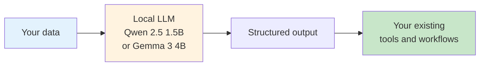

# AI Work Flow for Business

> **Enterprise automation, without the cloud.**
> Local LLMs, real workflows, no data leaving your network. ==আর কখন ক্লাউড ব্যবহার করা যাবে, সেটাও আলাপ হবে এখানে, বাংলায়==।

AI Work Flow for Business is a working library of patterns and reference implementations for using **local language models** to automate real enterprise operations, ISP support, bank IT, factory floor handovers, and more.

It is built for teams that need AI assistance but cannot send customer data, network logs, or internal documents to a public API.

---
!!! info "Can we avoid 'Cloud LLMs'?"

    Sometimes ==NO==. To safely use cloud LLMs without exposing sensitive business data, implement a hybrid **"local gateway"** architecture.

    An enterprise deploys a small, open-source AI model (like Llama 3) inside its private local network to act as a security firewall. When a user asks a question:

    1. The local model performs a private database search.
    2. It strips away all sensitive information like customer names, IP addresses, internal IDs and replaces them with generic tokens.
    3. Only the anonymized, abstract logic problem is sent to an enterprise-grade cloud API (Azure OpenAI, AWS Bedrock) that is legally bound by a zero-data-retention policy.
    4. The cloud LLM returns a structured response to the local network.
    5. The local gateway reinserts the real data before presenting the final answer to the user.

    The cloud LLM never sees the raw, sensitive data.

## Start here

-   :material-rocket-launch:{ .lg .middle } **[Why AI Work Flow for Business?](why-ai-work-flow.md)**

    ---

    What this project is, who it is for, and why a local-first design matters.

-   :material-play-circle:{ .lg .middle } **[See it run](demo.md)**

    ---

    Concrete examples of what you can automate today with a 1.5B-parameter local model.

-   :material-map:{ .lg .middle } **[Adoption journey](adoption/index.md)**

    ---

    A four-phase path from "what is this" to running in production across 5+ teams.

-   :material-sitemap:{ .lg .middle } **[Architecture](architecture/index.md)**

    ---

    How the layers fit together: LM Studio, FastAPI, ChromaDB, the modules on top.

## Who this is for

| Audience | What you get |
| --- | --- |
| **ISP / telco operations** (NOC, field ops, support) | Complaint classification, ticket routing, runbook Q&A |
| **Bank IT teams** | Internal helpdesk triage, network ops log analysis, SOP lookup |
| **Factory operations** | Shift handover summarization, anomaly flagging, maintenance ticket drafts |
| **University IT** *(later phase)* | Lab scheduling helpdesk, admissions Q&A |

If you handle sensitive operational data, this site is for you.

## How it works

No data leaves your network. No API keys. No vendor lock-in. The same Python code that runs on your laptop runs on your server.

## What's in the box

| Module | What it does | Doc |
| --- | --- | --- |
| ISP Classifier | Routes customer complaints by topic and priority | [docs](isp-classifier/index.md) |
| SLA System | Evaluates SLA breaches and ERP approvals | [docs](sla-system/index.md) |
| Qwen + RAG | Retrieval-augmented answers over your runbooks | [docs](qwen-rag/index.md) |
| HR Assistant | Leave, attendance, and HR FAQ automation | [docs](hr-assistant/index.md) |
| Smart Gift AI | Recommendation engine on top of a local LLM | [docs](smart-gift/index.md) |
| MLOps | Model registry, monitoring, A/B testing, retraining | [docs](mlops/index.md) |
| LLM Demos | Working examples of patterns (hierarchy, mini-quick, stress test) | [docs](llm-demos/index.md) |

## Project plan

This is an active project. See [ROADMAP.md](ROADMAP.md) for the locked decisions, audience, and the eight-session docs plan currently in progress.

Current status: **A2** (new information architecture + Why + Demo pages). See [AUDIT.md](AUDIT.md) for the current site audit.

## Quick start

1. Install [LM Studio](https://lmstudio.ai/) and load **Qwen 2.5 1.5B Instruct** (or **Gemma 3 4B** for harder reasoning).
2. Start the local server on `http://localhost:1234/v1`.
3. Open the [Getting Started](getting-started/index.md) guide and run your first script.

That's it. No cloud account, no API key, no telemetry.

!!! question "কথা বলতে চাচ্ছেন?"

    আমাকে Whataspp এ মেসেজ করতে পারেন: [+8801713095767](https://wa.me/+8801713095767)। আমি যেহেতু রোবট, কল থেকে মেসেজেই অভ্যস্ত৷। আমার সব আলাপ [মিডিয়াম](https://medium.com/@raqueeb), [ফেসবুক](https://www.facebook.com/raqueeb) এবং [লিংকডইনে](https://www.linkedin.com/in/raqueeb/) পাবেন।