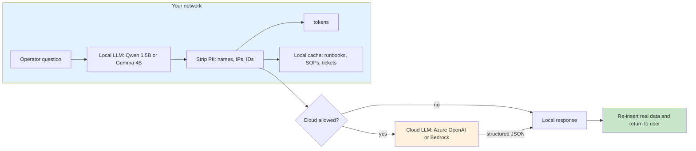

# AI Work Flow for Business

> **Local for sensitive data. Cloud for everything else.**
> Reference patterns for using LLMs in enterprise operations, with a clear policy for when to keep data on-prem and when a cloud model is the right call.

AI Work Flow for Business is a working library of patterns and reference implementations for using language models in real enterprise operations: ISP support, bank IT, factory floor handovers, HR helpdesks, network log triage, and more. The default is **local models on your own network** for anything that touches customer data, network logs, internal SOPs, or HR records. For non-sensitive workloads (public documentation, anonymized analytics, third-party SaaS output that has already been sanitized) the same code can target a cloud endpoint through a **local gateway** that scrubs the prompt before it leaves your network.

This site is not "no cloud, ever." It is **local-first by policy, cloud-allowed when the data permits it.**

!!! note "আমাদের এই টুলকিট আপনারা বাংলায় পড়তে পারেন"

    এই সাইটের বাংলা মিরর আছে [bangla/index.md](bangla/index.md)-এ। প্রতিটা মডিউলের বাংলা ভার্সন আলাদাভাবে পড়তে পারবেন, একই কন্টেন্ট, কথার ধাঁচে।

---
## The decision: local or cloud?

Run this against the workload before you pick a model:

| If the data is... | Default | Why |
| --- | --- | --- |
| Customer PII, network logs, internal SOPs, HR records, payment data | **Local** | Regulated. Legal will block anything else. |
| Anonymized telemetry, public docs, third-party SaaS output, code review | **Cloud acceptable** | No PII; cloud models are stronger and the cost is fine. |
| Mixed: some sensitive fields embedded in a larger request | **Local gateway** | Local model scrubs, then cloud is called on the sanitized version. |

The third row is the common case. The local gateway pattern is what this site actually recommends for most enterprises that think they want a cloud LLM.

## How the local gateway works

A small open-source model (Qwen 2.5 1.5B or Gemma 3 4B) runs inside your private network as a security firewall in front of an optional cloud API.

Five steps, regardless of which path the request takes:

1. The local model performs the private database search (runbook lookup, ticket history, employee record).
2. It strips PII — customer names, IP addresses, internal IDs — and replaces them with generic tokens.
3. A policy check decides: is the now-anonymized request safe to send to a cloud endpoint under your zero-data-retention contract?
4. The cloud LLM (if allowed) returns a structured response. The local model does the same if the request stayed on-prem.
5. The local gateway re-inserts the real data before the user sees the answer.

The cloud LLM never sees the raw sensitive data. The local LLM is always the one your operators talk to. Neither is a black box.

## Start here

-   :material-rocket-launch:{ .lg .middle } **[Why AI Work Flow for Business?](why-ai-work-flow.md)**

    ---

    What this project is, who it is for, and why a local-first design matters.

-   :material-play-circle:{ .lg .middle } **[See it run](demo.md)**

    ---

    Concrete examples of what you can automate today with a 1.5B-parameter local model.

-   :material-map:{ .lg .middle } **[Adoption journey](adoption/index.md)**

    ---

    A four-phase path from "what is this" to running in production across 5+ teams.

-   :material-sitemap:{ .lg .middle } **[Architecture](architecture/index.md)**

    ---

    How the layers fit together: LM Studio, FastAPI, ChromaDB, the modules on top.

## Who this is for

| Audience | What you get |
| --- | --- |
| **ISP / telco operations** (NOC, field ops, support) | Complaint classification, ticket routing, runbook Q&A |
| **Bank IT teams** | Internal helpdesk triage, network ops log analysis, SOP lookup |
| **Factory operations** | Shift handover summarization, anomaly flagging, maintenance ticket drafts |
| **University IT** *(later phase)* | Lab scheduling helpdesk, admissions Q&A |

If you handle sensitive operational data, **start local**. If your workload is mostly non-sensitive and you just want strong models, **the local-gateway pattern still gives you the same code path with cloud endpoints on the back end.** Either way, this site is for you.

The same Python code that runs on your laptop runs on your server, and the same code targets either a local LM Studio endpoint or a cloud endpoint by changing one URL. The local LLM is always the one your operators talk to — cloud endpoints are an internal implementation detail behind the gateway.

## What's in the box

| Module | What it does | Doc |
| --- | --- | --- |
| ISP Classifier | Routes customer complaints by topic and priority | [docs](isp-classifier/index.md) |
| SLA System | Evaluates SLA breaches and ERP approvals | [docs](sla-system/index.md) |
| Qwen + RAG | Retrieval-augmented answers over your runbooks | [docs](qwen-rag/index.md) |
| HR Assistant | Leave, attendance, and HR FAQ automation | [docs](hr-assistant/index.md) |
| Smart Gift AI | Recommendation engine on top of a local LLM | [docs](smart-gift/index.md) |
| MLOps | Model registry, monitoring, A/B testing, retraining | [docs](mlops/index.md) |
| LLM Demos | Working examples of patterns (hierarchy, mini-quick, stress test) | [docs](llm-demos/index.md) |
| Enterprise Apps | End-to-end apps: bank IT helpdesk, factory handover, ISP support | [docs](enterprise-apps/index.md) |
| AI Development | SDLC, reasoning techniques, citizen-developer patterns | [docs](ai-development/index.md) |
| Architecture | How the five layers fit: LM Studio, FastAPI, ChromaDB, modules | [docs](architecture/index.md) |
| Reference | Python API, configuration, troubleshooting | [docs](reference/index.md) |

## Project plan

This is an active project. See [ROADMAP.md](ROADMAP.md) for the locked decisions, audience, and the eight-session docs plan currently in progress.

Current status: **A2** (new information architecture + Why + Demo pages). The earlier A1 audit is archived at `archive/AUDIT-2026-06-06.md` for historical reference.

## Quick start

1. Install [LM Studio](https://lmstudio.ai/) and load **Qwen 2.5 1.5B Instruct** (or **Gemma 3 4B** for harder reasoning).
2. Start the local server on `http://localhost:1234/v1`.
3. Open the [Getting Started](getting-started/index.md) guide and run your first script.

That's it for the local path. **If you want to add a cloud endpoint for non-sensitive requests later**, flip the base URL in your `.env` from `http://localhost:1234/v1` to your Azure OpenAI / Bedrock endpoint, set `LOCAL_GATEWAY_ALLOW_CLOUD=true`, and the rest of the code is unchanged.

!!! question "কথা বলতে চাচ্ছেন?"

    আমাকে Whataspp এ মেসেজ করতে পারেন: [+8801713095767](https://wa.me/+8801713095767)। আমি যেহেতু রোবট, কল থেকে মেসেজেই অভ্যস্ত৷। আমার সব আলাপ [মিডিয়াম](https://medium.com/@raqueeb), [ফেসবুক](https://www.facebook.com/raqueeb) এবং [লিংকডইনে](https://www.linkedin.com/in/raqueeb/) পাবেন। এর পাশাপাশি [ইউটিউবে](https://www.youtube.com/@raqueeb) ভিডিও দেখতে পারেন।

    আমার মাথায় আর কি কি ঘোরে সেটাও পাবেন [এখানে](https://medium.com/@raqueeb/print-media-write-ups-2024-25-f2896ce92f7b)।