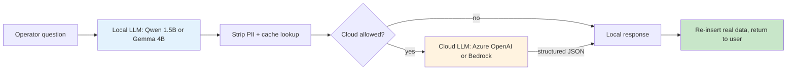

# AI Work Flow for Business

> **Adopt AI in your business. Keep your data on your network.**
> **A Forward Deployed Engineer (FDE) makes the rollout real** — they audit your data, build evals, and ship the gateway. Read the full [FDE chapter](adoption/fde.md).
> A short landing page in English and বাংলা. For the long version, see the chapters below.

!!! info "Read this page in your language"

    This page is **bilingual** — every section is in English and বাংলা side by side.
    If you prefer to read the **whole site in বাংলা**, start at [**বাংলা - হোম**](bangla/index.md).

AI Work Flow for Business is a working library of patterns and reference implementations for using language models in real enterprise operations. The default is **local models on your own network** for anything that touches customer data, network logs, internal SOPs, or HR records. For non-sensitive workloads the same code can target a cloud endpoint through a **local gateway** that scrubs the prompt before it leaves your network.

This site is not "no cloud, ever." It is **local-first by policy, cloud-allowed when the data permits it.**

!!! tip "One sentence, two languages"

    **English:** *Adopt AI in your business, keep your data on your network, and use a Forward Deployed Engineer (FDE) to make the rollout real.*
    **বাংলা:** *ব্যবসায় AI আনুন, ডেটা নিজের নেটওয়ার্কে রাখুন, আর রোলআউট বাস্তব করতে একজন Forward Deployed Engineer (FDE) নিয়োগ করুন।*

---

## The core idea

| English | বাংলা |
| --- | --- |
| Sensitive data stays on your network. | সংবেদনশীল ডেটা আপনার নেটওয়ার্কেই থাকে। |
| A small local LLM answers first. | একটি ছোট লোকাল LLM আগে উত্তর দেয়। |
| The cloud is only used for sanitized text. | ক্লাউড শুধু ঝাড়াই-করা টেক্সটের জন্য ব্যবহৃত হয়। |
| A Forward Deployed Engineer runs the rollout. | Forward Deployed Engineer (FDE) রোলআউটটি পরিচালনা করেন। |

---

## The decision: local or cloud?

| If the data is... | English default | বাংলায় ডিফল্ট |
| --- | --- | --- |
| Customer PII, network logs, internal SOPs, HR records, payment data | **Local** — regulated, legal will block anything else | **লোকাল** — নিয়ন্ত্রিত, আইনি দল অন্যটা বন্ধ করবে |
| Anonymized telemetry, public docs, third-party SaaS output, code review | **Cloud acceptable** — no PII, stronger model, fine cost | **ক্লাউড চলবে** — কোনো PII নেই, মডেল শক্তিশালী, খরচ সহনীয় |
| Mixed: some sensitive fields in a larger request | **Local gateway** — local scrubs, then cloud on sanitized text | **লোকাল গেটওয়ে** — লোকাল ঝাড়ায়, তারপর ক্লাউডে পাঠায় |

The third row is the common case. The local gateway is the pattern this site recommends for most enterprises.

---

## How a Forward Deployed Engineer helps your business

| Step | English (what the FDE does) | বাংলা (FDE কী করেন) |
| --- | --- | --- |
| **Audit** | Walks your data flows, finds what is sensitive, picks the local/cloud split. | আপনার ডেটা প্রবাহ ঘুরে দেখেন, সংবেদনশীল অংশ চিহ্নিত করেন, লোকাল-ক্লাউড ভাগাভাগি ঠিক করেন। |
| **Evals** | Builds offline test sets, measures accuracy, picks the model size. | অফলাইন টেস্ট সেট বানান, নির্ভুলতা মাপেন, মডেলের সাইজ ঠিক করেন। |
| **Deployment** | Ships the gateway, monitors it, retrains, and hands it back to your team. | গেটওয়ে চালু করেন, মনিটর করেন, পুনঃপ্রশিক্ষণ দেন, শেষে আপনার দলের হাতে ফেরত দেন। |

!!! info "Why an FDE is mandatory for local-LLM businesses"

    Local-first AI is not "install LM Studio and walk away." It is a **deployment** of a small, regulated model into a real workflow, with evals, monitoring, retraining, and a human in the loop. A Forward Deployed Engineer owns that loop end-to-end. Without one, the project stalls at the demo.

Read the full chapter: [adoption/fde.md](adoption/fde.md). The four phases in [adoption/index.md](adoption/index.md) are the FDE playbook: discover → pilot → scale → build.

## Start here

-   :material-rocket-launch:{ .lg .middle } **[Why AI Work Flow for Business?](why-ai-work-flow.md)**

    ---

    What this project is, who it is for, and why a local-first design matters.

-   :material-play-circle:{ .lg .middle } **[See it run](demo.md)**

    ---

    Concrete examples of what you can automate today with a 1.5B-parameter local model.

-   :material-account-hard-hat:{ .lg .middle } **[What is an FDE?](adoption/fde.md)**

    ---

    The Forward Deployed Engineer role: audit, evals, deployment, and handover.

-   :material-map:{ .lg .middle } **[Adoption journey](adoption/index.md)**

    ---

    A four-phase path from "what is this" to running in production across 5+ teams.

-   :material-sitemap:{ .lg .middle } **[Architecture](architecture/index.md)**

    ---

    How the layers fit together: LM Studio, FastAPI, ChromaDB, the modules on top.

## Who this is for

| Audience | English — what you get | বাংলা — আপনি যা পান |
| --- | --- | --- |
| **ISP / telco operations** (NOC, field ops, support) | Complaint classification, ticket routing, runbook Q&A | অভিযোগ শ্রেণিবিন্যাস, টিকিট রাউটিং, রানবুক প্রশ্ন-উত্তর |
| **Bank IT teams** | Internal helpdesk triage, network log analysis, SOP lookup | ইন্টারনাল হেল্পডেস্ক, নেটওয়ার্ক লগ বিশ্লেষণ, SOP লুকআপ |
| **Factory operations** | Shift handover summarization, anomaly flagging, maintenance drafts | শিফট হ্যান্ডওভার সারাংশ, অসঙ্গতি চিহ্নিতকরণ, মেইনটেন্যান্স ড্রাফট |

**University IT, government, and other sectors** — see [Case Studies](case-studies/index.md) for the full audience map.

If you handle sensitive operational data, **start local**. If your workload is mostly non-sensitive and you just want strong models, the local-gateway pattern still gives you the same code path with cloud endpoints on the back end. Either way, this site is for you.

## Quick start

1. Install [LM Studio](https://lmstudio.ai/) and load **Qwen 2.5 1.5B Instruct** (or **Gemma 3 4B** for harder reasoning).
2. Start the local server on `http://localhost:1234/v1`.
3. Open the [Getting Started](getting-started/index.md) guide and run your first script.

That's it for the local path. **If you want to add a cloud endpoint for non-sensitive requests later**, flip the base URL in your `.env` from `http://localhost:1234/v1` to your Azure OpenAI / Bedrock endpoint, set `LOCAL_GATEWAY_ALLOW_CLOUD=true`, and the rest of the code is unchanged.

!!! question "কথা বলতে চাচ্ছেন?"

    আমাকে Whataspp এ মেসেজ করতে পারেন: [+8801713095767](https://wa.me/+8801713095767)। আমি যেহেতু রোবট, কল থেকে মেসেজেই অভ্যস্ত৷। আমার সব আলাপ [মিডিয়াম](https://medium.com/@raqueeb), [ফেসবুক](https://www.facebook.com/raqueeb) এবং [লিংকডইনে](https://www.linkedin.com/in/raqueeb/) পাবেন। এর পাশাপাশি [ইউটিউবে](https://www.youtube.com/@raqueeb) ভিডিও দেখতে পারেন।

    আমার মাথায় আর কি কি ঘোরে সেটাও পাবেন [এখানে](https://medium.com/@raqueeb/print-media-write-ups-2024-25-f2896ce92f7b)।