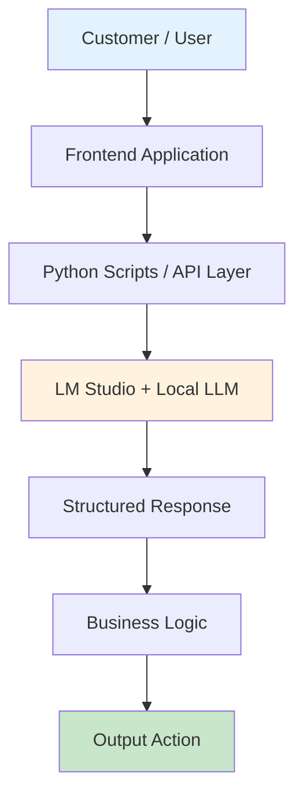
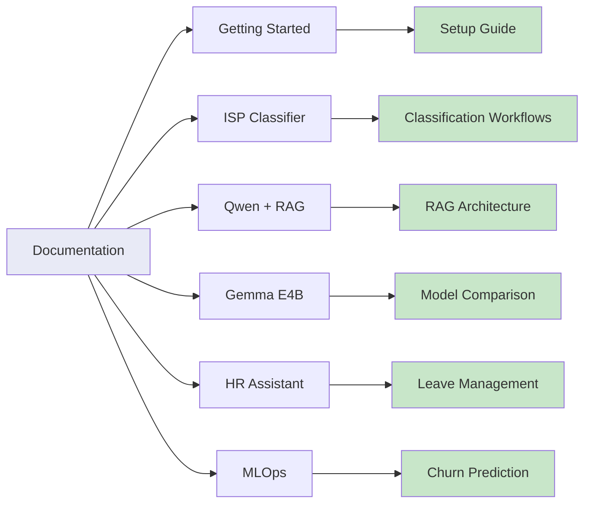
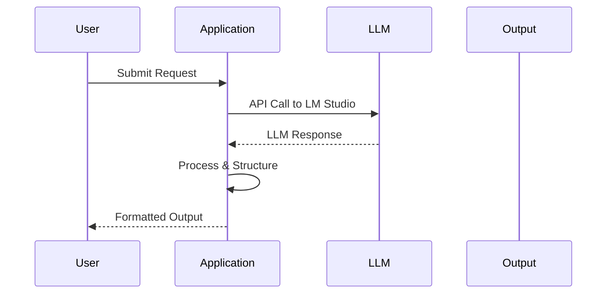
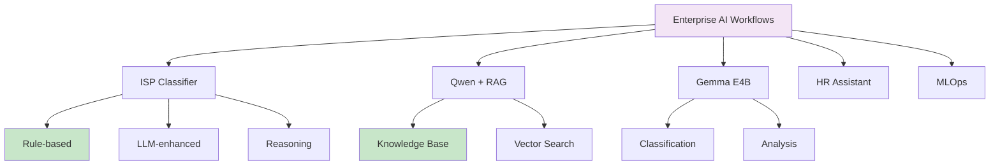

# Enterprise AI Automations Documentation

Welcome to the Enterprise AI Automations documentation. This site is built for ISP/Service Company and enterprise teams who want to understand how local LLMs can replace rule-based systems and act as the "brain" behind everyday applications. But, we want to start with baby steps.

All guides here use **local LLM setups** via LM Studio, keeping your data private and your work to be delivered fast.

## System Overview

The following diagram shows how all components connect in the Enterprise AI system:

## Documentation Architecture

## Data Flow Sequence

## Project Structure

## Quick Navigation

| Section | Description | Model |
|---------|-------------|-------|
| [Getting Started](getting-started/index.md) | Setup LM Studio and first script | Qwen 2.5 |
| [ISP Classifier](isp-classifier/index.md) | Customer complaint classification | Qwen |
| [Qwen + RAG](qwen-rag/index.md) | Knowledge-augmented responses | Qwen 2.5 |
| [Gemma E4B](gemma-e4b/index.md) | Advanced classification | Gemma 4-bit |
| [HR Assistant](hr-assistant/index.md) | Leave and employee management | Qwen |
| [MLOps](mlops/index.md) | Churn prediction pipeline | Gemma |

## Key Technologies

- **LM Studio**: Local LLM runtime with API server
- **Qwen 2.5 1.5B**: Fast, efficient for most tasks
- **Gemma 4 E4B**: Higher quality for complex reasoning
- **ChromaDB**: Vector database for RAG
- **FastAPI/Flask**: API framework

## Getting Help

- Check the [Getting Started](getting-started/index.md) guide for setup instructions
- Review individual module documentation for specific use cases
- Refer to Python scripts in the repository for implementation details
