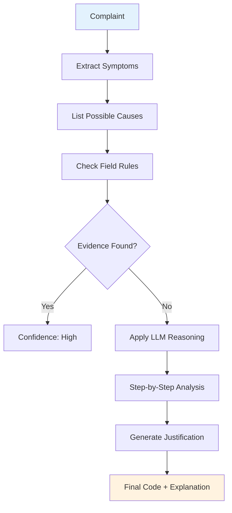
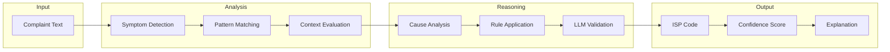

# ISP Classifier with Reasoning

This advanced classifier not only classifies complaints but also explains the reasoning behind each decision.

## Chain-of-Thought Reasoning Flow



## Reasoning Pipeline



## When to Use Reasoning

| Scenario | Basic Classifier | Reasoning Classifier |
|----------|-----------------|---------------------|
| Simple keywords | Yes | Yes |
| Multiple symptoms | No | Yes |
| Complex complaints | No | Yes |
| Audit requirements | No | Yes |
| Team training | No | Yes |

## Example Output

```
Complaint: "Customer says internet is slow and WiFi keeps dropping"

Reasoning Steps:
1. Two symptoms identified: slow speed + intermittent connection
2. Possible causes: router overload, interference, ISP throttling
3. Checking field conditions... WiFi dropping suggests router issue
4. Final analysis: Router configuration problem

Result: ISP-002 (Router Issue)
Confidence: 87%
Justification: WiFi drops + slow speed points to router problem
```

## Running the Demo

```bash
python app-reasoning1.py
python app-reasoning2.py
```

## Benefits

- **Transparency**: Shows why each classification was made
- **Accuracy**: Multi-step analysis catches edge cases
- **Training**: Helps new team members understand patterns
- **Audit Trail**: Complete documentation of decisions
