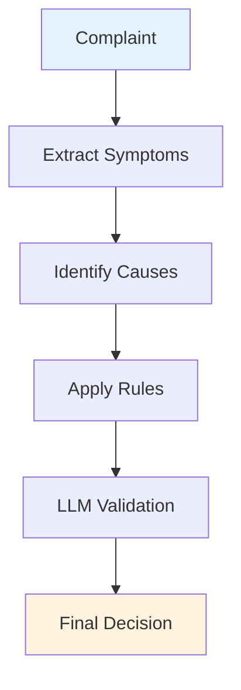
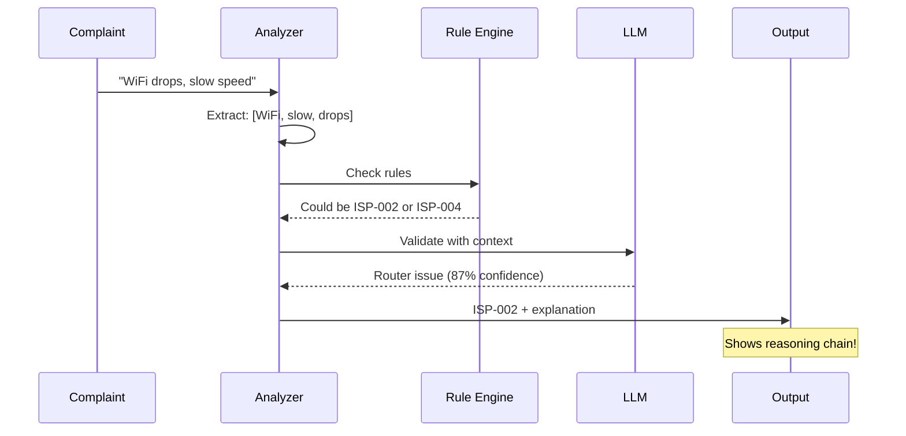
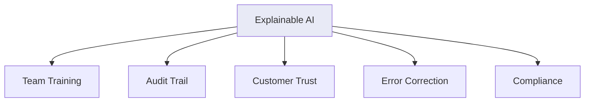
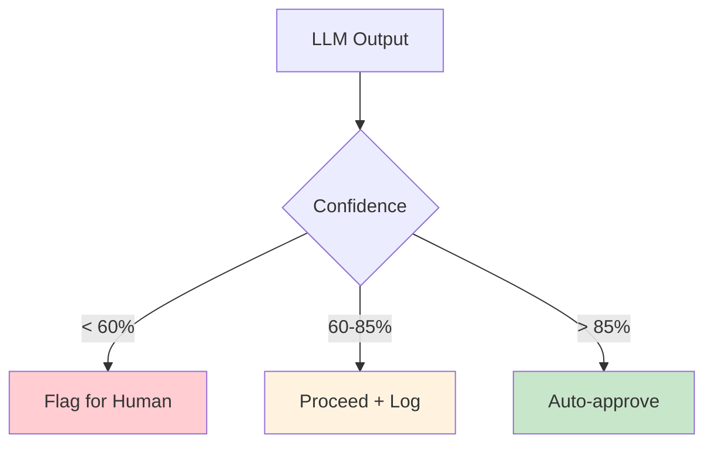

# AI Reasoning

Chain-of-thought reasoning for transparent, explainable classifications.

## Reasoning Pipeline



## Step-by-Step Flow



## Reasoning Depth Levels

| Level | Description | Use Case |
|-------|-------------|----------|
| Surface | Keyword match | Simple cases |
| Context | Consider surrounding | Moderate |
| Deep | Chain-of-thought | Complex |
| Meta | Self-reflection | Edge cases |

## Transparency Benefits



## Example Output

```
Complaint: "My internet was working fine yesterday, 
but this morning the WiFi icon shows connected but 
pages won't load. I tried restarting the router."

Reasoning Chain:
1. Symptoms: "connected but no pages", "tried restarting router"
2. Possible causes: DNS issue, router config, ISP outage
3. Key insight: "Restarted router but issue persists"
4. Rule match: Router restart suggests local issue
5. LLM validation: Confirms router/DNS problem

Result: ISP-003 (DNS Issue)
Confidence: 89%
Explanation: Connected but no browsing + router restart = likely DNS
```

## When Reasoning Matters

| Scenario | Basic | Reasoning |
|----------|-------|-----------|
| Keyword match | ✅ | ✅ |
| Multiple symptoms | ❌ | ✅ |
| Conflicting signals | ❌ | ✅ |
| Training new staff | ❌ | ✅ |
| Audit requirements | ❌ | ✅ |
| Customer disputes | ❌ | ✅ |

## Confidence Calibration



## Implementation

```python
def reasoning_classify(text):
    # Step 1: Extract symptoms
    symptoms = extract_symptoms(text)
    
    # Step 2: Generate possible causes
    causes = suggest_causes(symptoms)
    
    # Step 3: Apply rules
    rule_matches = apply_rules(causes)
    
    # Step 4: LLM validation
    validated = llm_validate(rule_matches, symptoms)
    
    # Step 5: Generate explanation
    explanation = generate_reasoning_chain(validated)
    
    return {
        "code": validated["code"],
        "confidence": validated["confidence"],
        "reasoning": explanation
    }
```

## Next Steps

- [MLOps Monitoring](../mlops/index.md) - Track reasoning quality
- [Enterprise Apps](../enterprise-apps/index.md) - Scale up