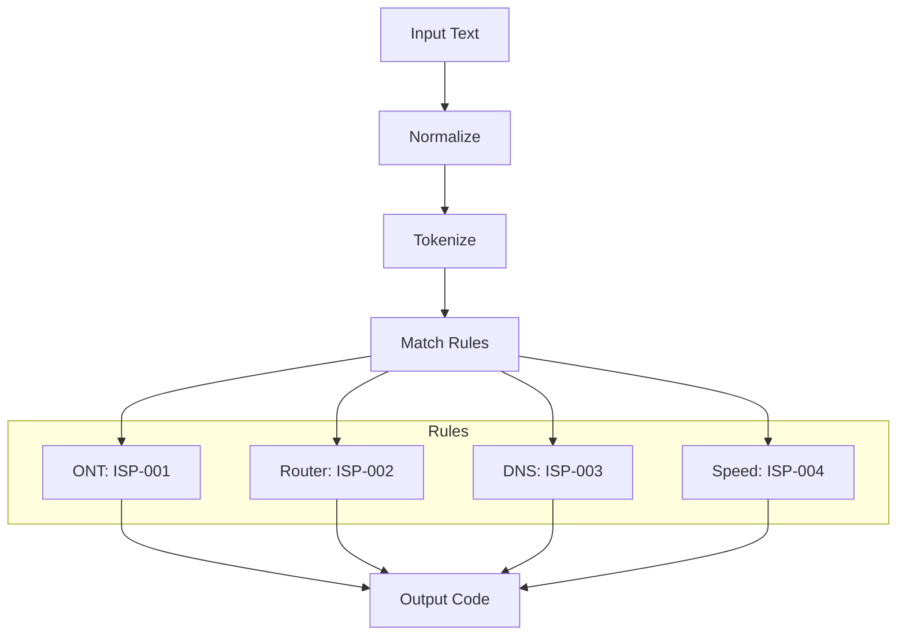
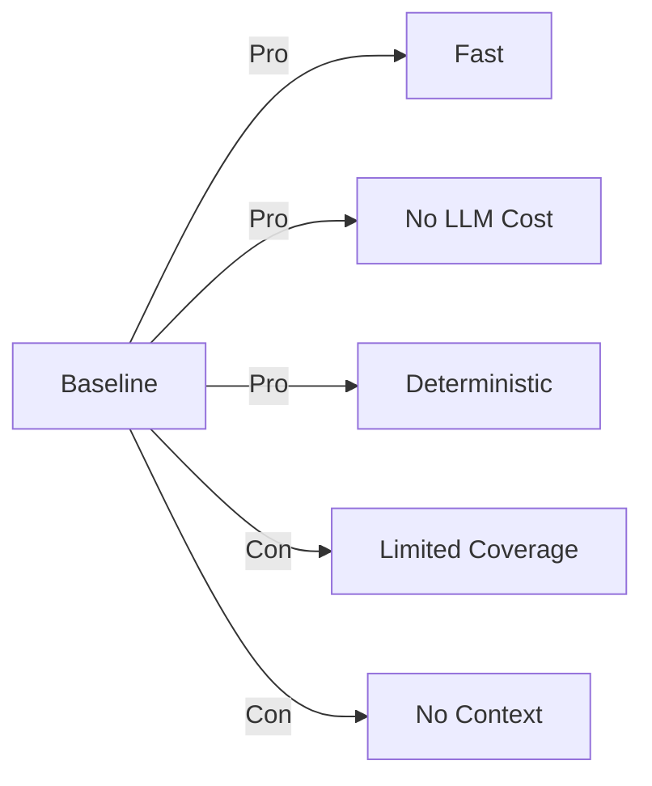

# Baseline Classifier

Rule-based classification using keyword matching for fast, deterministic results.

## How It Works

```mermaid
flowchart TD
    A[Complaint Text] --> B[Text Preprocessing]
    B --> C[Keyword Extraction]
    C --> D[Lookup Dictionary]
    D --> E{Match Found?}
    E -->|Yes| F[Return ISP Code]
    E -->|No| G[Return "Unknown"]
    
    style F fill:#c8e6c9
    style G fill:#ffcdd2
```

## Rule Engine Architecture



## Keyword Mapping

| Keywords | ISP Code | Description |
|----------|----------|-------------|
| ont, red light, fiber, no signal | ISP-001 | ONT/Fiber Issue |
| router, wifi, wi-fi, wireless | ISP-002 | Router Problem |
| dns, resolve, can't access | ISP-003 | DNS Issue |
| slow, buffering, lag | ISP-004 | Speed Problem |
| billing, payment, charge | ISP-005 | Billing Issue |
| outage, down, no connection | ISP-006 | Outage |

## Performance Comparison



## Code Example

```python
ISP_CODES = {
    "ISP-001": ["ont", "red light", "fiber", "no signal"],
    "ISP-002": ["router", "wifi", "wi-fi", "wireless"],
    "ISP-003": ["dns", "resolve", "can't access"],
    "ISP-004": ["slow", "buffering", "lag"],
    "ISP-005": ["billing", "payment", "charge"],
    "ISP-006": ["outage", "down", "no connection"],
}

def classify_baseline(text):
    text_lower = text.lower()
    for code, keywords in ISP_CODES.items():
        if any(kw in text_lower for kw in keywords):
            return code
    return "ISP-UNKNOWN"
```

## When to Use

| Use Case | Recommended |
|----------|-------------|
| Simple complaints | ✅ Yes |
| High volume, low complexity | ✅ Yes |
| Edge cases, ambiguous text | ❌ No |
| Need explanations | ❌ No |

## Next Steps

- [LLM Classifier](../isp-classifier/llm-classifier.md) - Handle complex cases
- [Classifier Comparison](../isp-classifier/comparison.md) - See full comparison