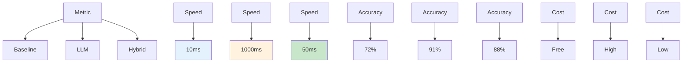
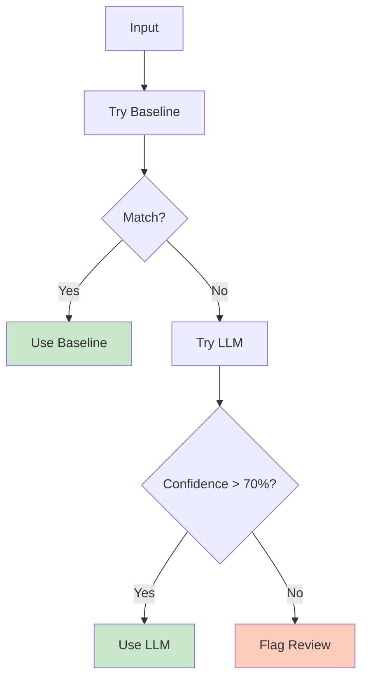
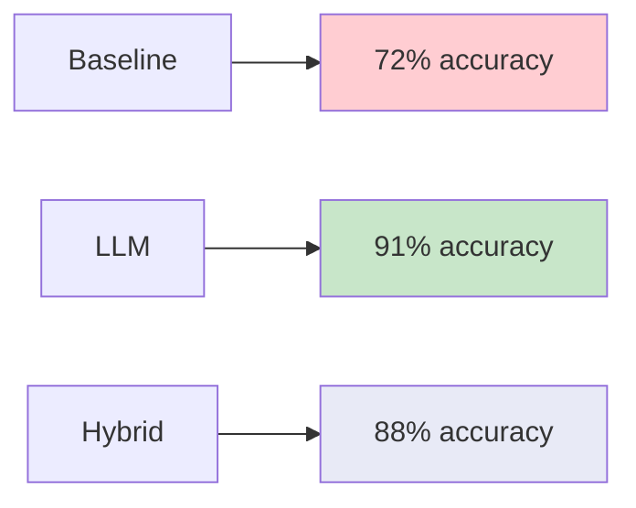
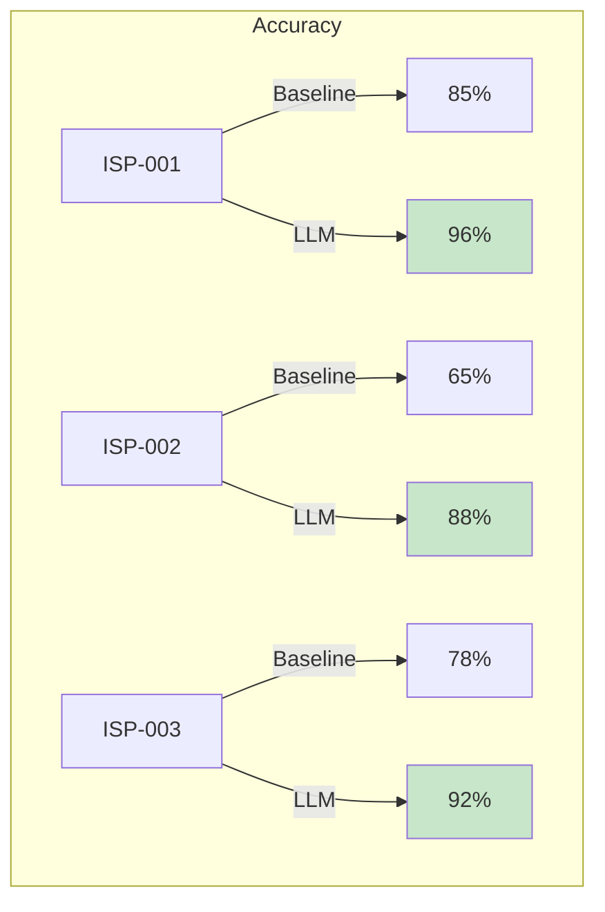
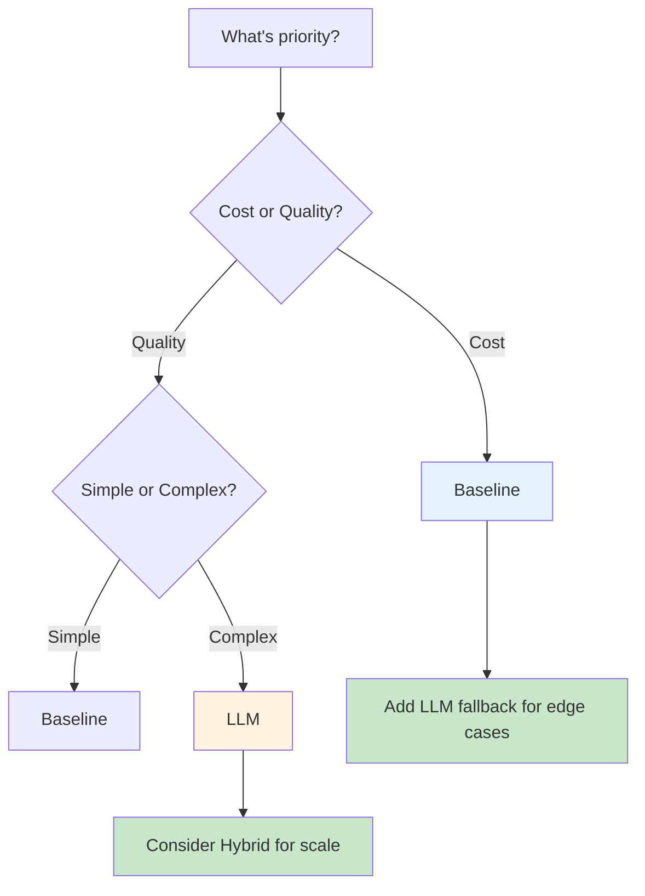

# Classifier Comparison

Side-by-side comparison of all classification approaches.

## Performance Matrix

## Decision Flow

## Use Case Recommendation

| Scenario | Recommendation | Reason |
|----------|----------------|--------|
| Simple keywords | Baseline | Fast & free |
| Ambiguous text | LLM | Better context |
| High volume | Hybrid | Balanced |
| Real-time needed | Hybrid | Speed + accuracy |
| Complex issues | LLM | Reasoning |
| Audit required | LLM | Full trace |

## Test Results (55 Cases)

## Cost Analysis

| Approach | Per Call | Per Day (1000) | Monthly |
|----------|----------|----------------|---------|
| Baseline | $0.00 | $0.00 | $0.00 |
| LLM | $0.002 | $2.00 | $60.00 |
| Hybrid | $0.0002 | $0.20 | $6.00 |

## Accuracy by Category

## Recommendation Summary

## Next Steps

- [ISP Reasoning](../isp-classifier-reasoning/index.md) - Add explanations
- [MLOps](../mlops/index.md) - Monitor & improve