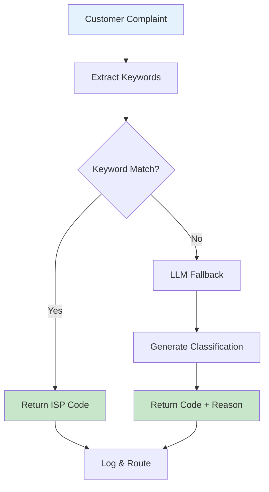
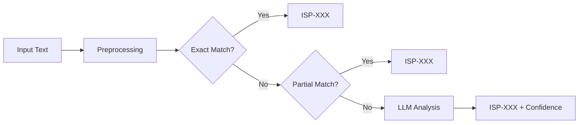
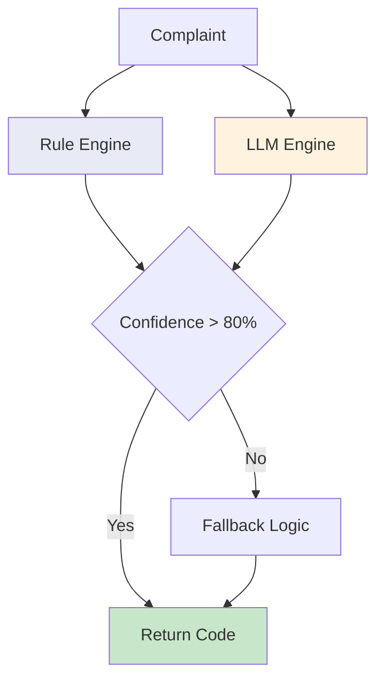
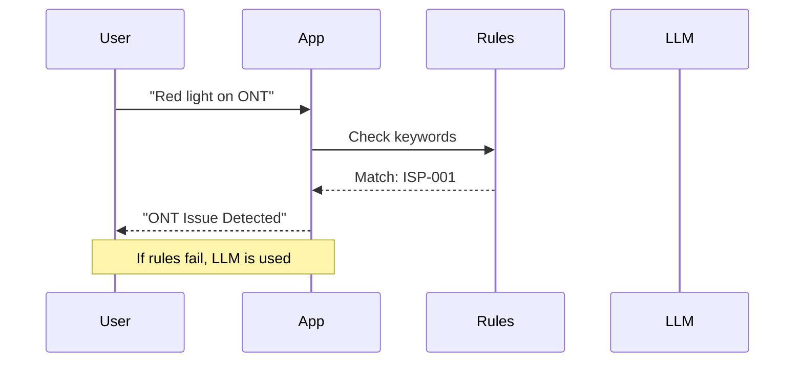

# ISP Classifier

The ISP Classifier automatically categorizes customer complaints into diagnostic codes for faster resolution.

## Classification Workflow



## Multi-Stage Classification



## Architecture Diagram



## ISP Codes Reference

| Code | Description | Example |
|------|-------------|---------|
| ISP-001 | ONT/Fiber Issue | Red light, no fiber |
| ISP-002 | Router Problem | WiFi not working |
| ISP-003 | DNS Issue | Can't resolve sites |
| ISP-004 | Speed Problem | Slow connection |
| ISP-005 | Billing Issue | Payment error |
| ISP-006 | Outage | Area-wide down |

## Demo Scripts

```bash
# Rule-based classifier
python app-baseline-class.py

# LLM-enhanced classifier
python app-classifier1.py
```

## How It Works


