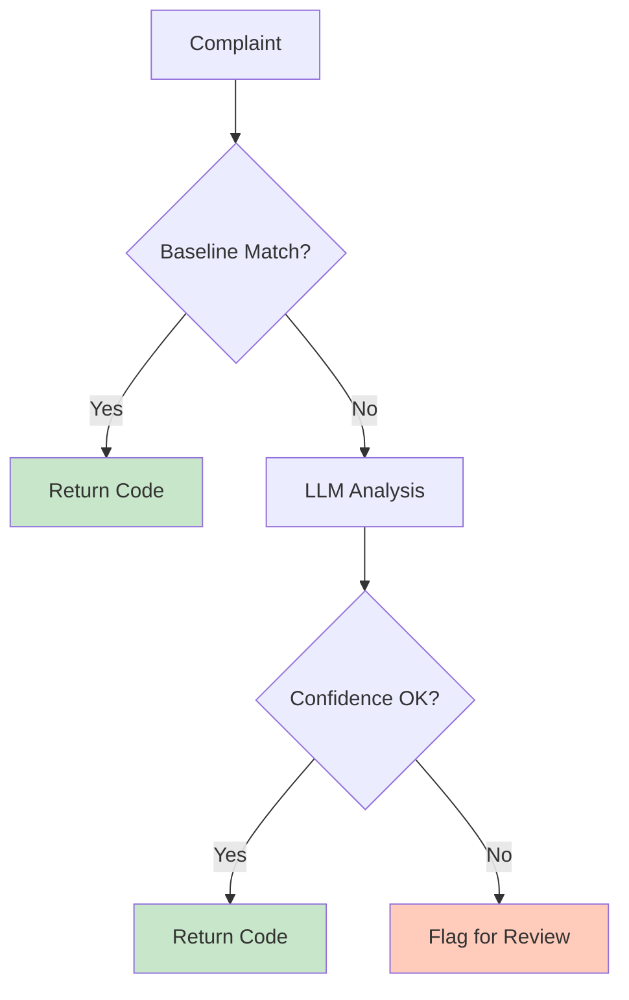
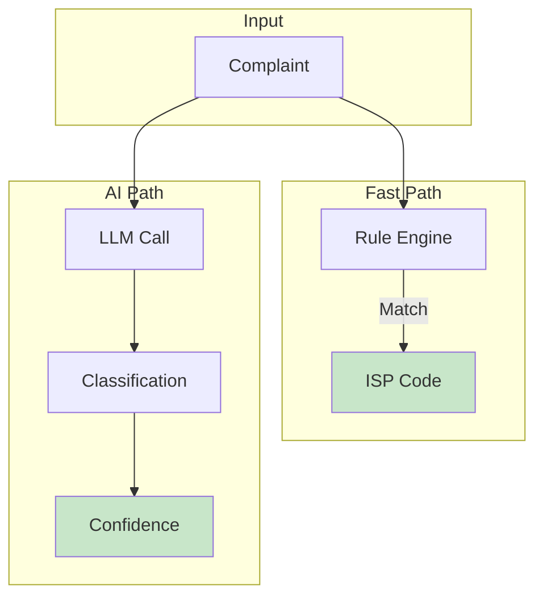
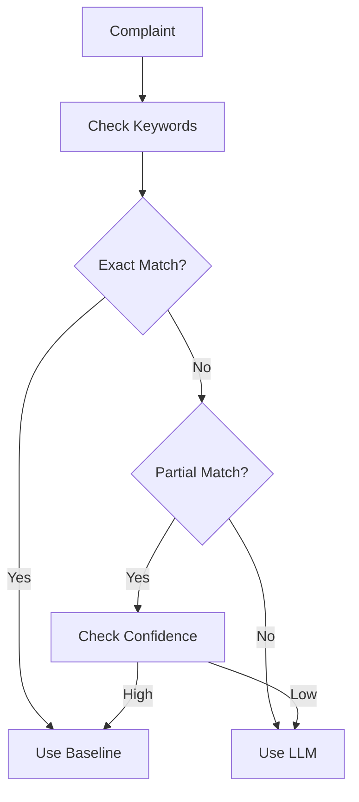

# LLM Classifier

AI-powered classification that understands context and handles edge cases.

## Architecture



## Hybrid Approach



## Prompt Template

```mermaid
graph LR
    A[System] -->|Classify this complaint|
    B[User] -->|Complaint text|
    C[Assistant] -->|ISP Code + Reason|
    
    style C fill:#c8e6c9
```

## Response Format

```json
{
  "code": "ISP-002",
  "confidence": 0.92,
  "reasoning": "WiFi issues combined with router reference indicates router problem",
  "alternatives": ["ISP-001", "ISP-004"]
}
```

## Comparison with Baseline

| Aspect | Baseline | LLM |
|--------|----------|-----|
| Speed | <10ms | 500-2000ms |
| Cost | Free | API call |
| Coverage | Keyword-based | Contextual |
| Edge cases | Poor | Good |
| Explanation | No | Yes |

## When LLM Kicks In



## Code Example

```python
def classify_llm(text):
    prompt = f"""Classify this ISP complaint:
    
    Complaint: {text}
    
    Categories:
    - ISP-001: ONT/Fiber issues
    - ISP-002: Router problems
    - ISP-003: DNS issues
    - ISP-004: Speed problems
    
    Return JSON with code, confidence, and reasoning.
    """
    
    response = call_llm(prompt)
    return parse_response(response)
```

## Best Practices

| Tip | Description |
|-----|-------------|
| Fallback | Always have baseline ready |
| Cache | Cache common patterns |
| Batch | Batch similar requests |
| Monitor | Track low-confidence cases |