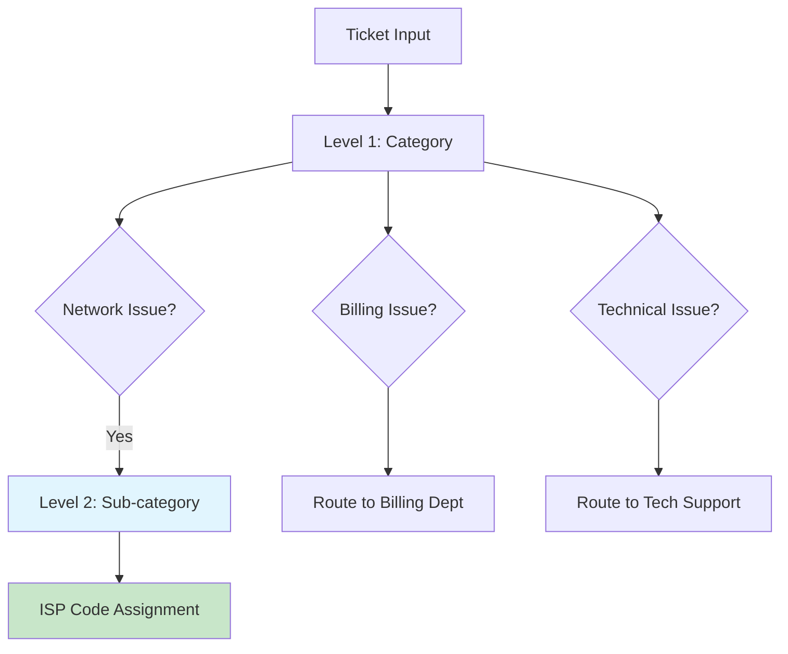

# Hierarchical Classification

Multi-level ticket classification using hierarchical routing.

## Hierarchical Flow



## Classification Levels

### Level 1 - Category Detection
- Network issues
- Billing concerns
- Technical support
- General inquiries

### Level 2 - Sub-category
- Connection problems
- Speed issues
- Equipment failure
- Payment processing

### Level 3 - Specific Code
- ISP-001: ONT issue
- ISP-002: Router problem
- ISP-003: Cable damage

## Implementation

```python
def hierarchical_classify(ticket):
    # Level 1
    category = detect_category(ticket)
    
    # Level 2
    subcategory = detect_subcategory(ticket, category)
    
    # Level 3
    code = assign_isp_code(ticket, category, subcategory)
    
    return {"category": category, "subcategory": subcategory, "code": code}
```