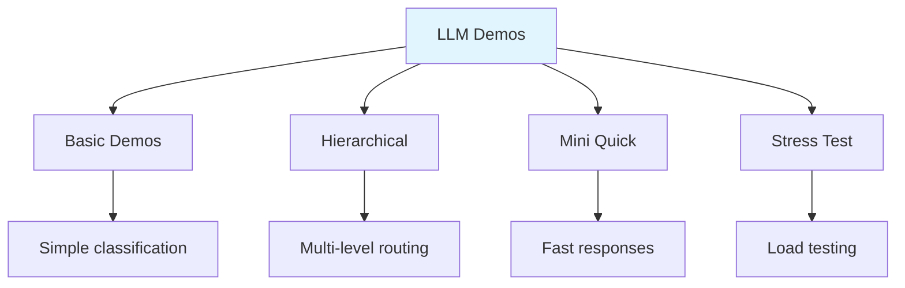
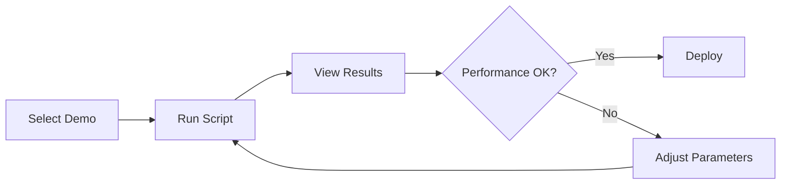

# LLM Demos

Collection of demonstrations for various local LLM configurations and use cases.

## Demo Overview

## Demo Categories

| Demo | Use Case | Model |
|------|----------|-------|
| LM Demos | Basic text classification | Qwen 2.5 |
| Hierarchy | Multi-level routing | Qwen 2.5 |
| Mini Quick | Rapid prototyping | Qwen 2.5 |
| Stress Test | Load testing | Various |

## Quick Start

