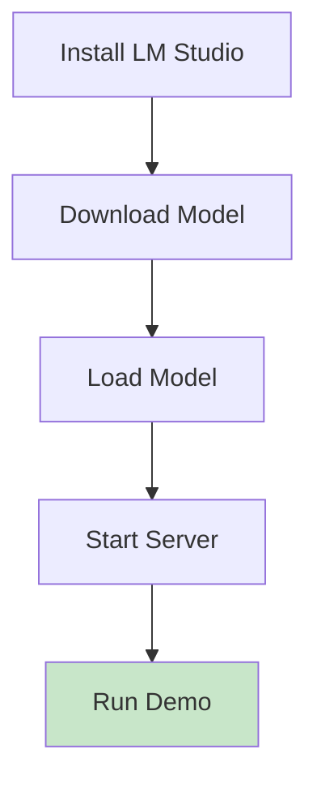
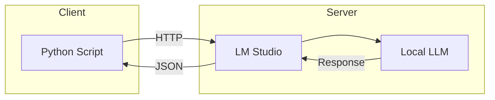

# LM Studio Demos

Basic demonstrations using LM Studio for local LLM inference.

## Setup Flow



## Demo Scripts

### Basic Classification
```python
# lm_demo_small_10case.py
import requests

response = requests.post(
    "http://localhost:1234/v1/chat/completions",
    json={"messages": [{"role": "user", "content": "..."}]}
)
```

## Architecture



## Features

- Simple API calls
- JSON response parsing
- Error handling
- Batch processing support