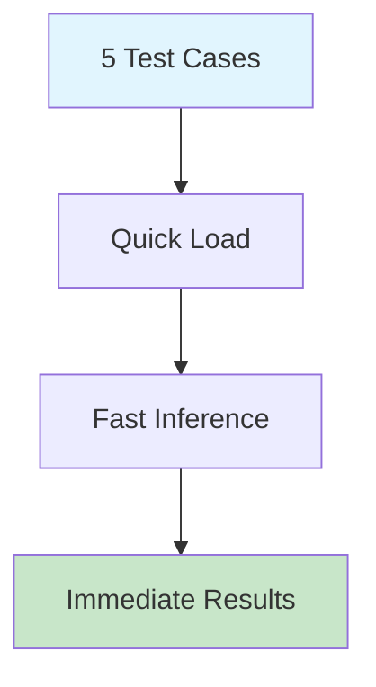

# Mini Quick Demo

Rapid prototyping demo for quick LLM integration testing.

## Quick Demo Flow



## Use Cases

- **API Testing**: Verify LM Studio connection
- **Prompt Tuning**: Quick iteration on prompts
- **Model Comparison**: Fast evaluation of responses

## Demo Script

```python
# llm_mini_demo_5cases.py
cases = [
    "Internet completely down",
    "Slow connection at night",
    "Bill shows wrong amount",
    "Router making noise",
    "Cannot connect WiFi"
]

for case in cases:
    result = classify_ticket(case)
    print(f"Input: {case}")
    print(f"Code: {result['code']}")
```

## Performance Metrics

| Metric | Target |
|--------|--------|
| Response Time | < 2 seconds |
| Accuracy | > 80% |
| Memory Usage | < 2GB |