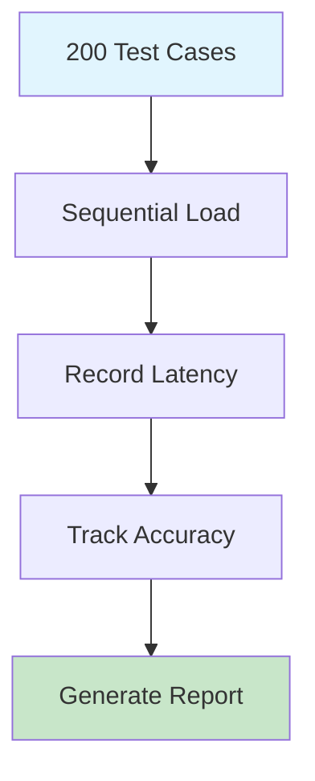
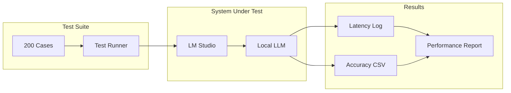

# Stress Testing

Load testing and performance benchmarking for LLM systems.

## Test Workflow

## Stress Test Architecture

## Key Metrics

| Metric | Description | Threshold |
|--------|-------------|-----------|
| Latency | Response time per request | < 3 seconds |
| Accuracy | Classification correctness | > 85% |
| Throughput | Requests per minute | > 10/min |
| Memory | RAM usage during test | < 4GB |

## Test Categories

- **Baseline Test**: Standard query-response
- **Batch Test**: Large volume processing
- **Concurrent Test**: Multiple simultaneous requests
- **Long-running Test**: Extended operation stability