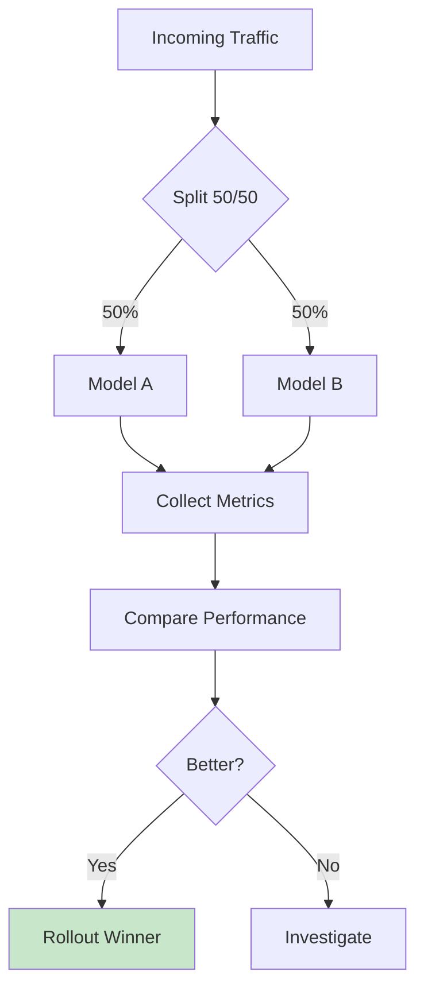
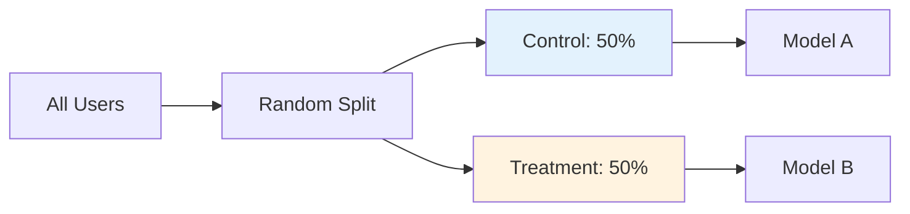
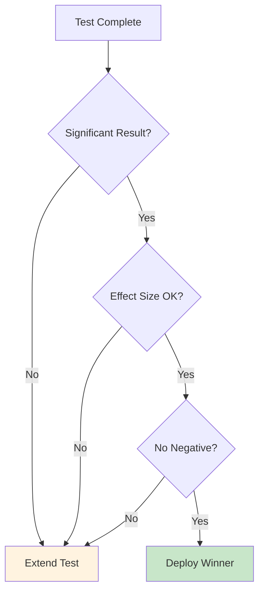
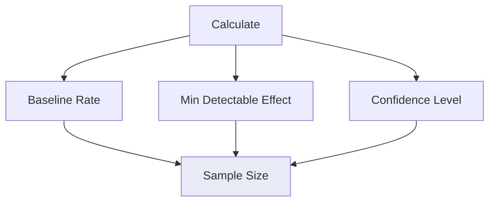

# A/B Testing

Systematic comparison of model versions in production.

## A/B Test Flow



## Traffic Splitting



## Test Configuration

```yaml
ab_test:
  name: churn-v3-vs-v4
  start_date: 2026-05-01
  duration: 14 days
  
traffic:
  control: 0.5
  treatment: 0.5
  
metrics:
  primary: conversion_rate
  secondary:
    - latency
    - error_rate
    - user_satisfaction
```

## Decision Framework



## Statistical Analysis

| Metric | Model A | Model B | Winner |
|--------|---------|---------|--------|
| Accuracy | 87% | 89% | B (+2%) |
| Latency | 45ms | 52ms | A (faster) |
| Conversion | 23% | 28% | B (+5%) |

## Minimum Sample Size



## Implementation

```python
import random

def predict_with_ab_test(input_data, model_a, model_b, test_group):
    if test_group == "control":
        return model_a.predict(input_data)
    else:
        return model_b.predict(input_data)

def assign_group(user_id):
    # Consistent assignment
    return "control" if user_id % 2 == 0 else "treatment"
```

## Monitoring During Test

| Day | Control | Treatment | Delta |
|-----|---------|-----------|-------|
| 1-3 | 23.1% | 23.8% | +0.7% |
| 4-7 | 22.9% | 25.1% | +2.2% |
| 8-10 | 23.4% | 27.3% | +3.9% |
| 11-14 | 23.2% | 28.1% | +4.9% |

## Next Steps

- [Retraining](./retraining.md) - Update underperforming models
- [Model Registry](./model-registry.md) - Store test results