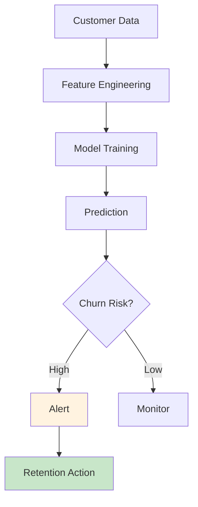
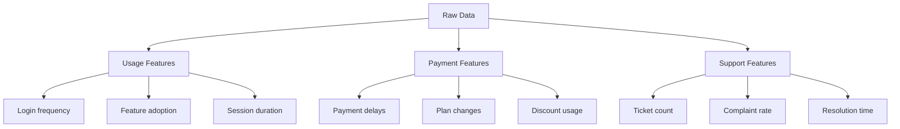
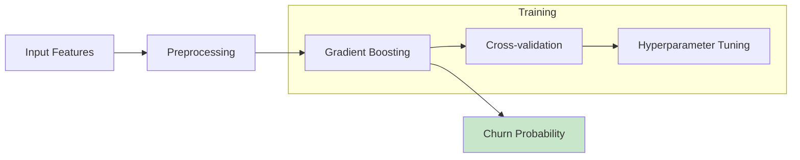
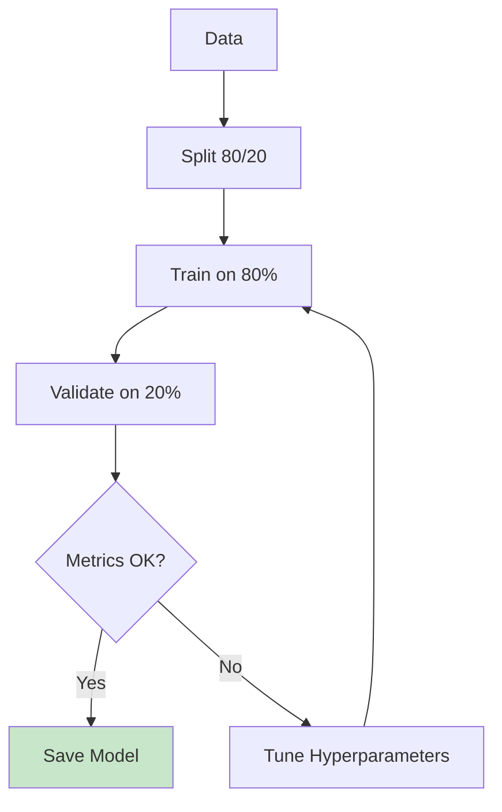

# Customer Churn Prediction

ML pipeline for predicting and preventing customer churn.

## Churn Prediction Flow



## Feature Engineering



## Model Architecture



## Key Features

| Feature | Importance | Description |
|---------|------------|-------------|
| Days since last login | High | Engagement indicator |
| Support tickets (30d) | High | Dissatisfaction signal |
| Payment delay count | High | Financial stress |
| Feature usage % | Medium | Product adoption |
| Plan downgrade | Medium | Cost sensitivity |
| Age of account | Low | Loyalty indicator |

## Prediction Output

```json
{
  "customer_id": "CUST-12345",
  "churn_probability": 0.78,
  "risk_level": "HIGH",
  "top_factors": [
    "No login in 14 days",
    "3 support tickets this month",
    "Payment delayed twice"
  ],
  "recommended_action": "Proactive outreach"
}
```

## Training Pipeline



## Evaluation Metrics

| Metric | Target | Critical |
|--------|--------|----------|
| AUC-ROC | >0.85 | <0.75 |
| Precision | >0.70 | <0.50 |
| Recall | >0.75 | <0.60 |
| F1 Score | >0.72 | <0.55 |

## Business Impact

| Action | Cost | Effectiveness |
|--------|------|----------------|
| Discount offer | $50 | 40% retention |
| Personal call | $25 | 60% retention |
| Service upgrade | $100 | 75% retention |

## Next Steps

- [Model Registry](./model-registry.md) - Store trained models
- [Monitoring](./monitoring.md) - Track performance