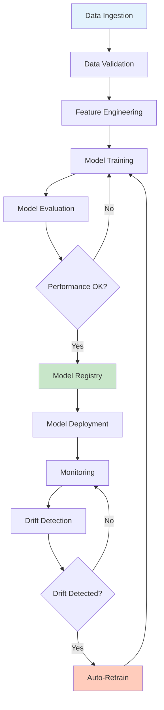
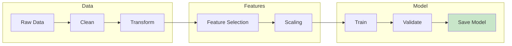
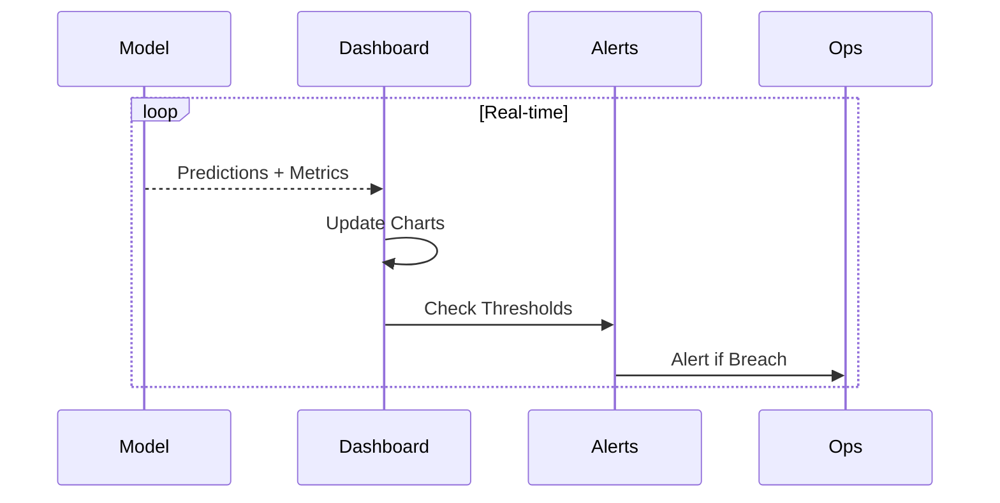
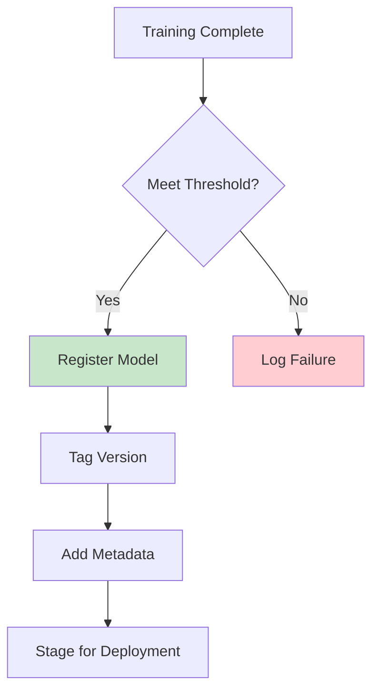
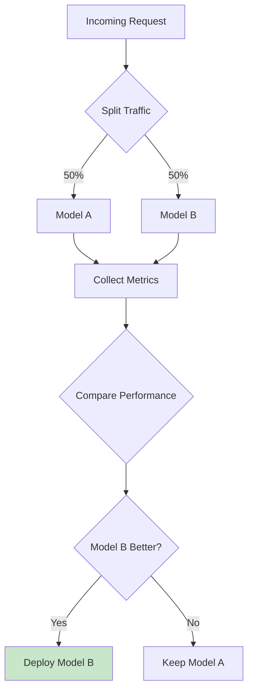

# MLOps - Customer Churn Prediction

End-to-end MLOps pipeline for predicting and preventing customer churn.

## MLOps Pipeline Overview



## Training Pipeline



## Monitoring Dashboard



## Model Registry Flow



## A/B Testing Framework



## Key Components

| Component | Purpose |
|-----------|---------|
| Model Registry | Store and version models |
| Monitoring | Track performance metrics |
| Drift Detection | Detect data/concept drift |
| Auto-Retrain | Trigger retraining when needed |

## Performance Baselines

| Metric | Target | Critical |
|--------|--------|----------|
| Accuracy | >85% | <80% |
| Precision | >80% | <75% |
| Recall | >82% | <78% |
| Latency | <500ms | >1000ms |

## Running the Pipeline

```bash
# Start monitoring
python mlops/monitoring_dashboard.py

# Run complete pipeline
python mlops/churn_pipeline.py

# Check model registry
python mlops/model_registry.py --list
```
