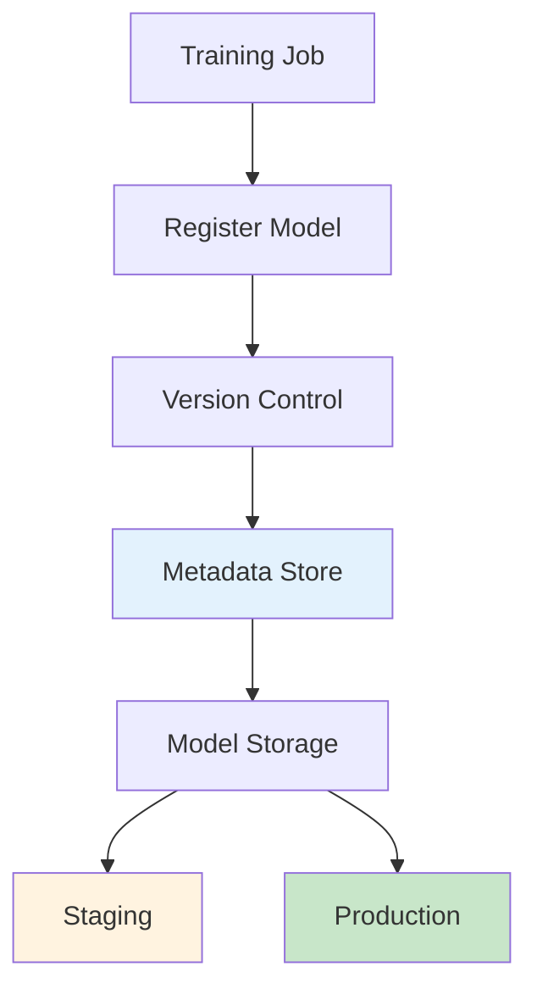
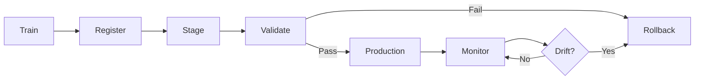
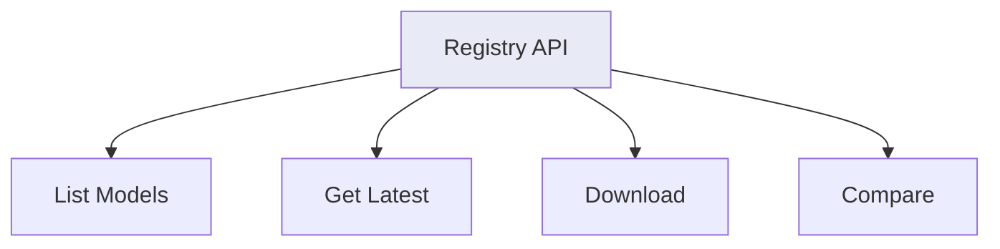
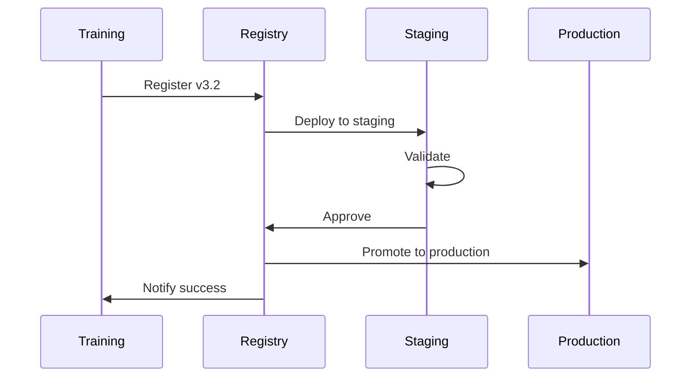

# Model Registry

Centralized storage and versioning for ML models.

## Registry Architecture



## Version Lifecycle



## Model Card

```yaml
model:
  name: churn-predictor-v3
  version: 3.2.1
  created: 2026-05-07
  framework: sklearn 1.3
  
performance:
  auc_roc: 0.89
  precision: 0.78
  recall: 0.82
  
metadata:
  train_samples: 50000
  features: 24
  runtime: 45ms
  
artifacts:
  model_file: churn_v3.pkl
  config: config_v3.json
```

## Registry Operations



## Code Example

```python
import mlflow

# Register model
mlflow.sklearn.log_model(
    model, 
    "churn-predictor",
    registered_model_name="production-churn"
)

# Get latest version
model = mlflow.sklearn.load_model(
    "models:/production-churn/latest"
)

# Compare versions
compare = mlflow.registered_model.get_model_version_benchmark(
    "production-churn"
)
```

## Version Comparison

| Version | AUC-ROC | Latency | Status |
|---------|---------|---------|--------|
| 3.0 | 0.85 | 45ms | Retired |
| 3.1 | 0.87 | 48ms | Staging |
| 3.2 | 0.89 | 42ms | Production |

## Promotion Workflow



## Best Practices

| Practice | Benefit |
|-----------|---------|
| Semantic versioning | Clear updates |
| Model cards | Full documentation |
| A/B validation | Safe deployment |
| Rollback plan | Risk mitigation |

## Next Steps

- [Monitoring](./monitoring.md) - Track deployed models
- [A/B Testing](./ab-testing.md) - Compare versions