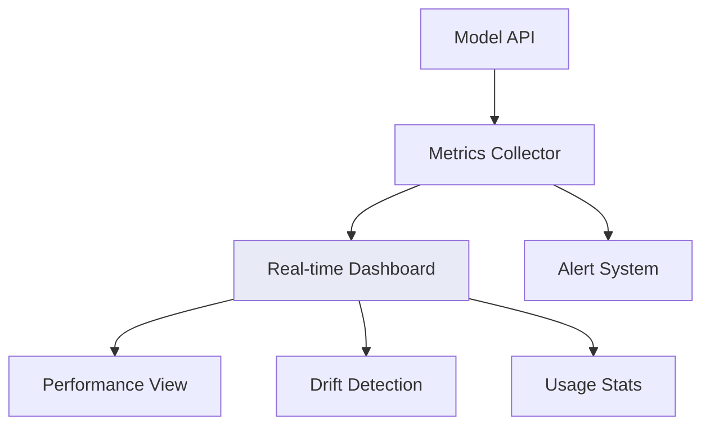
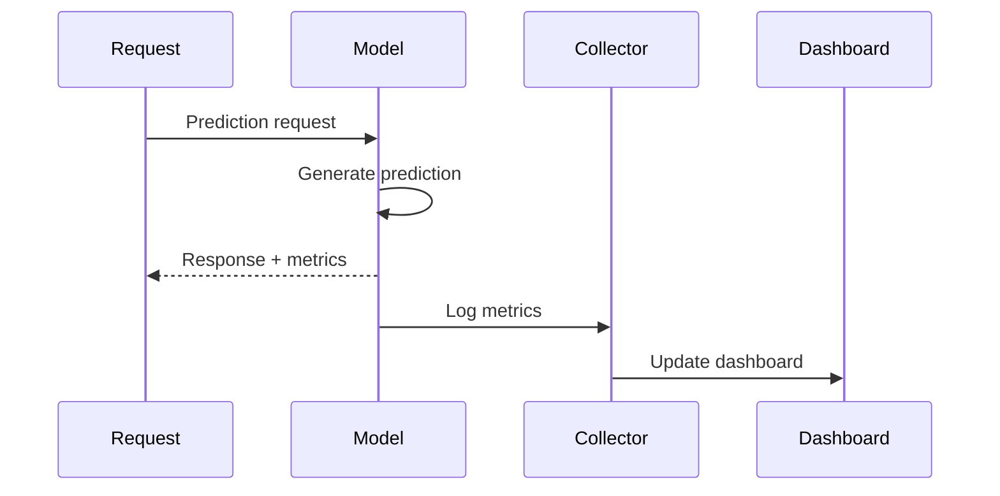
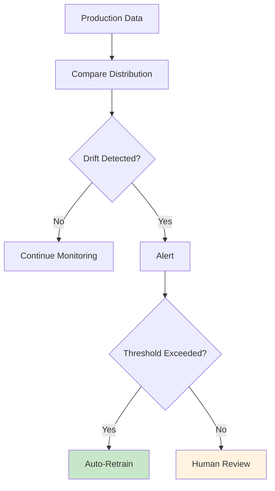
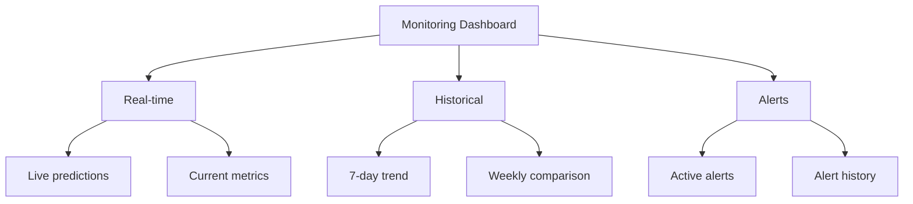

# Model Monitoring

Real-time tracking of model performance and health.

## Monitoring Dashboard



## Key Metrics

| Metric | Current | Target | Status |
|--------|---------|--------|--------|
| Accuracy | 87% | >85% | ✅ |
| Latency P99 | 150ms | <200ms | ✅ |
| Error Rate | 0.5% | <1% | ✅ |
| Drift Score | 0.02 | <0.05 | ✅ |

## Data Flow



## Drift Detection



## Types of Drift

| Type | Description | Detection |
|------|-------------|-----------|
| Data Drift | Input distribution changes | PSI, KL divergence |
| Concept Drift | Target relationship changes | Performance drop |
| Model Drift | Model quality degrades | Accuracy decline |

## Alert Configuration

```yaml
alerts:
  data_drift:
    metric: psi_score
    threshold: 0.1
    action: notify
  
  performance_drop:
    metric: accuracy
    threshold: 0.05
    action: page_team
  
  latency_spike:
    metric: p99_latency
    threshold: 500ms
    action: page_team
```

## Monitoring Code

```python
import prometheus_client

accuracy = prometheus_client.Gauge('model_accuracy')
latency = prometheus_client.Histogram('model_latency')

def predict(input_data):
    start = time.time()
    result = model.predict(input_data)
    latency.observe(time.time() - start)
    accuracy.set(calculate_accuracy(result))
    return result
```

## Dashboard Components



## Next Steps

- [A/B Testing](./ab-testing.md) - Test model changes
- [Retraining](./retraining.md) - Update models