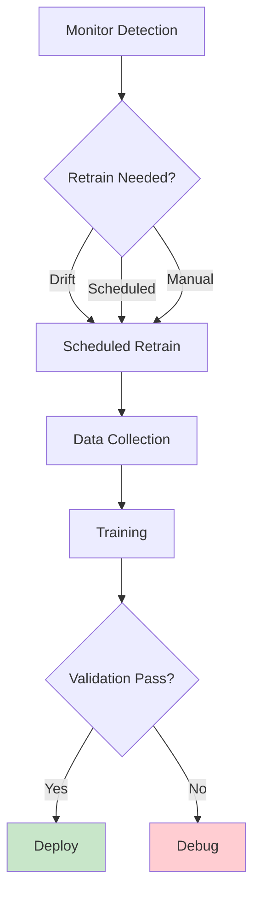
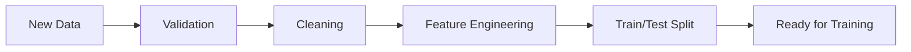
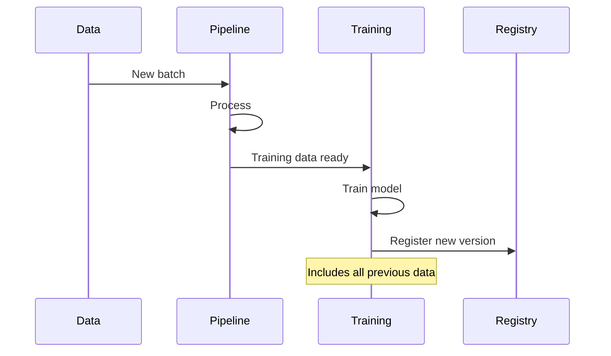
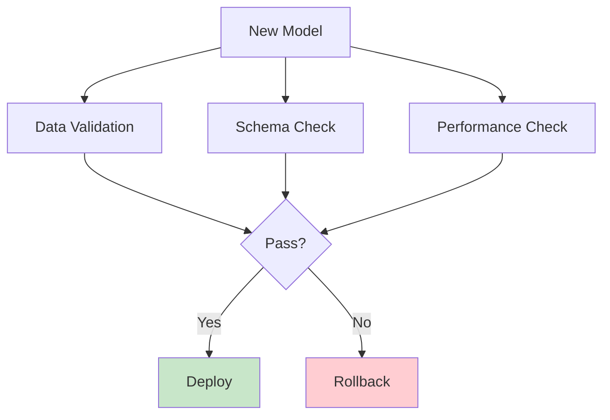
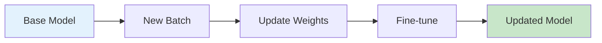

# Model Retraining

Automated pipeline for keeping models current with new data.

## Retraining Trigger



## Trigger Conditions

| Trigger | Threshold | Action |
|---------|-----------|--------|
| Data Drift | PSI > 0.2 | Retrain |
| Performance | Accuracy < 85% | Retrain |
| Schedule | Every 30 days | Retrain |
| Manual | User request | Retrain |

## Data Pipeline



## Training Workflow



## Validation Checks



## Checkpoint Strategy

```python
class RetrainPipeline:
    def run(self):
        # 1. Load accumulated data
        data = self.collect_new_data()
        
        # 2. Combine with historical
        combined = self.combine_with_history(data)
        
        # 3. Train with earlier data for validation
        model = self.train(combined)
        
        # 4. Validate against holdout
        if not self.validate(model):
            self.alert_team("Validation failed")
            return
        
        # 5. Register and deploy
        self.register_model(model)
        self.deploy()
```

## Incremental Learning



## Fallback Strategy

| Failure Type | Action |
|--------------|--------|
| Training crashes | Keep previous model |
| Validation fails | Alert + manual review |
| Deployment fails | Rollback to last good |
| Performance worse | Revert immediately |

## Metrics Comparison

| Metric | Before | After | Change |
|--------|--------|-------|--------|
| Accuracy | 85% | 88% | +3% |
| AUC-ROC | 0.87 | 0.90 | +0.03 |
| Precision | 78% | 82% | +4% |
| Recall | 81% | 84% | +3% |

## Timeline

```
Day 0: Trigger detected
Day 1: Data collection complete
Day 2: Training begins
Day 3: Validation complete
Day 4: Deploy to production
Day 5: Monitor for issues
```

## Next Steps

- [Monitoring](./monitoring.md) - Track new model
- [Model Registry](./model-registry.md) - Store retrained versions