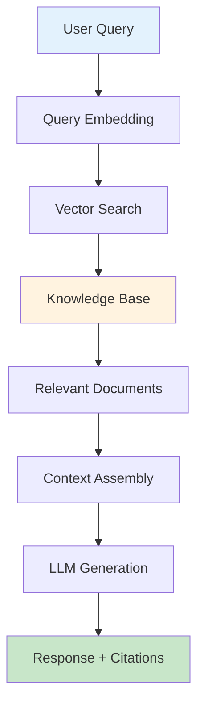
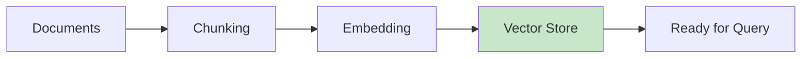
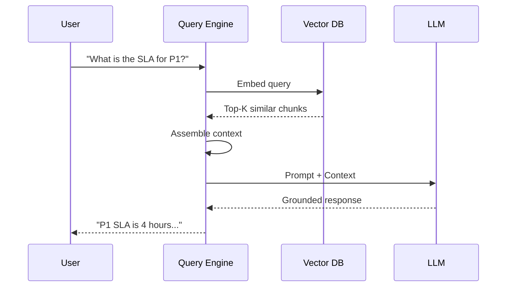
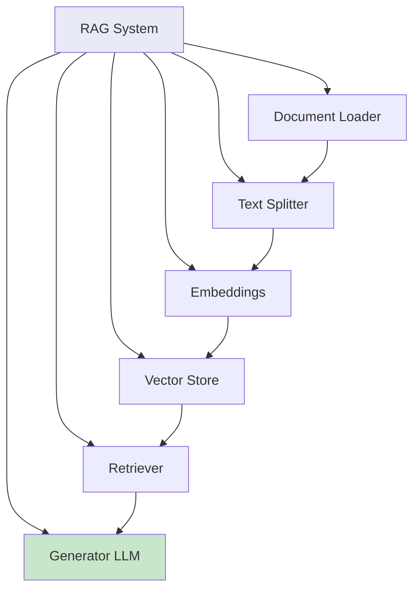
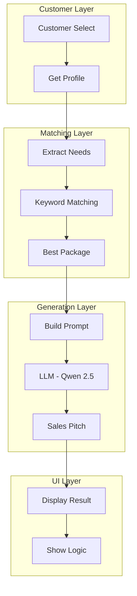
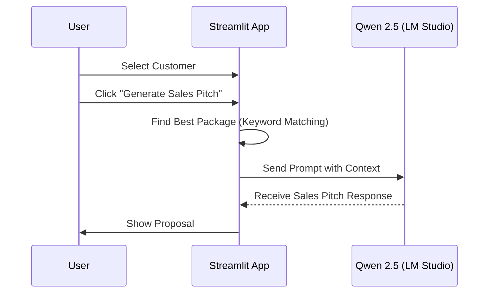

# Qwen + RAG

RAG (Retrieval-Augmented Generation) combines your documents with the LLM to provide accurate, grounded responses.

## RAG Architecture



## Document Processing Flow



## Query Processing Pipeline



## RAG vs Direct LLM

| Aspect | Direct LLM | RAG |
|--------|-----------|-----|
| Knowledge | Training data only | Your documents |
| Accuracy | May hallucinate | Grounded in facts |
| Updates | Retrain needed | Update knowledge base |
| Citations | Not available | Source citations |

## Key Components



## Use Cases

- **Policy Compliance**: Answer questions from company policies
- **Technical Support**: Grounded in troubleshooting guides
- **HR Queries**: Based on employee handbook
- **Training**: Onboarding documentation

## Quick Start

```bash
# 1. Prepare your documents
# 2. Index them into vector store
python qwen-rag/index_documents.py

# 3. Query the knowledge base
python qwen-rag/query_knowledge.py
```

## Performance Tips

| Factor | Recommendation |
|--------|----------------|
| Chunk size | 500-1000 tokens |
| Top-K results | 3-5 documents |
| Embedding model | Use same for index/query |

## ISP Sales Bot (isp_sales.py)

This is an intelligent sales assistant that generates personalized Bangla/English sales pitches for ISP customers. It uses keyword matching and LLM generation.

### Features

- **Customer Profiles**: Track customer's current plan and requirements
- **Product Catalog**: Multiple ISP packages with keywords
- **Smart Matching**: Keyword-based package recommendation
- **Bilingual Output**: Bangla + English sales pitches

### Architecture



### Workflow



### Sample Customer Profiles

| Customer | Current Plan | Needs | Best Match |
|----------|--------------|-------|------------|
| Arif Ahmed | 5 Mbps | YouTube, browsing | Standard Plan (P1) |
| Sultana Razia | 10 Mbps | Netflix, 4K movies | Entertainment Pro (P2) |
| Tanvir Hasan | 20 Mbps | Work from home, VPN | Business Executive (P3) |
| Farhana Islam | None (New) | Social media, research | Student Starter (P4) |

### Product Catalog

| Package | Speed | Keywords |
|---------|-------|----------|
| P1: Standard | 10 Mbps | YouTube, browsing |
| P2: Entertainment Pro | 20 Mbps | Netflix, 4K, streaming |
| P3: Business Executive | 100 Mbps | VPN, business, Zoom |
| P4: Student Starter | 5 Mbps | student, affordable |

### Running the App

```bash
cd c:\Downloads\classifier-app\qwen-rag
streamlit run isp_sales.py
```

Access at: http://localhost:8501

### Requirements

- LM Studio running at `http://localhost:1234`
- Qwen 2.5 1.5B model loaded
- Streamlit installed

### Benefits

| Benefit | Description |
|---------|-------------|
| Personalization | Tailored pitches based on customer needs |
| Bilingual | Bangla builds trust, English explains details |
| Speed | Real-time generation with local LLM |
| Privacy | All processing happens locally |

---

## Related Documentation

- [Getting Started](../getting-started/index.md)
- [ISP Classifier](../isp-classifier/index.md)
- [Enterprise Apps](../enterprise-apps/index.md)
