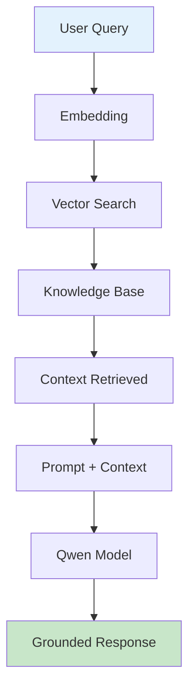
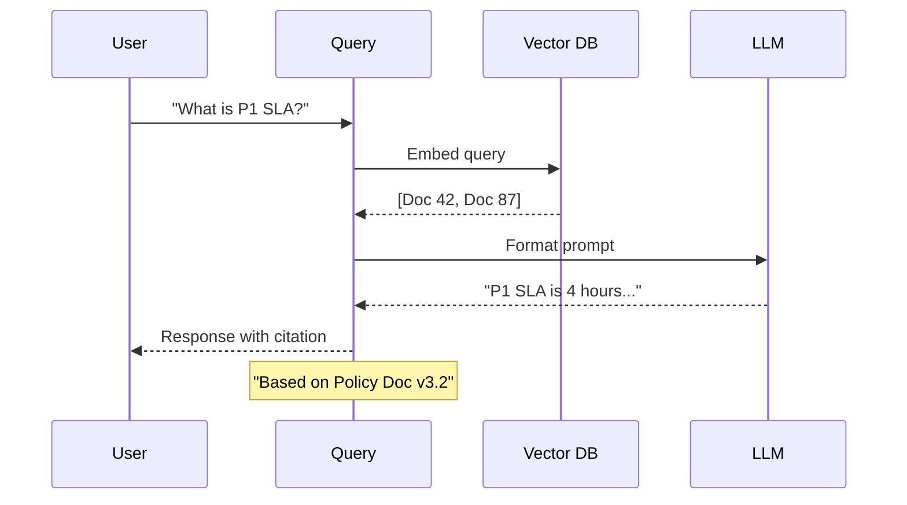

# Qwen RAG Demo

End-to-end demonstration of Retrieval-Augmented Generation with Qwen.

## Demo Architecture



## Demo Flow



## Setup Steps

| Step | Task | Command |
|------|------|---------|
| 1 | Start LM Studio with Qwen | UI |
| 2 | Install dependencies | `pip install faiss-cpu sentence-transformers` |
| 3 | Prepare documents | Place in `data/` folder |
| 4 | Index documents | `python index_docs.py` |
| 5 | Run demo | `python demo.py` |

## Document Processing


## Query Processing

```python
def query_rag(user_query, vector_store, llm):
    # 1. Embed query
    query_embedding = embed_model.encode(user_query)
    
    # 2. Search vector store
    results = vector_store.similarity_search(query_embedding, k=3)
    
    # 3. Build context
    context = "\n\n".join([r.content for r in results])
    
    # 4. Generate response
    prompt = f"Context: {context}\n\nQuestion: {user_query}"
    response = llm.generate(prompt)
    
    return response, results
```

## Sample Output

```
User: "What are the steps for customer escalation?"

Response: "To escalate a customer issue:
1. Log the complaint with ticket ID
2. Attempt first-level resolution
3. If unresolved after 2 hours, escalate to Tier 2
4. Document all attempts in the system

[Source: SOP-Docs/page-42, SOP-Docs/page-87]
```

## Evaluation Metrics

| Metric | Description | Target |
|--------|-------------|--------|
| Retrieval Precision | Relevant docs retrieved | >85% |
| Response Accuracy | Factual correctness | >90% |
| Citation Accuracy | Sources correctly cited | >95% |
| Latency | Response time | <3s |

## Next Steps

- [Simple RAG](./simple-rag.md) - Basic implementation
- [Vector Storage](./vector-storage.md) - Deep dive