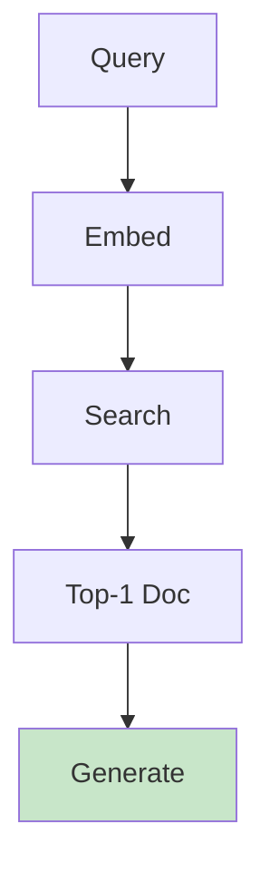

# Simple RAG

Minimal RAG implementation for quick experimentation.

## Minimal Architecture



## Quick Start

```python
from langchain.vectorstores import Chroma
from langchain.embeddings import OpenAIEmbeddings

# 1. Load documents
loader = TextLoader("knowledge.txt")
docs = loader.load()

# 2. Split text
splitter = RecursiveCharacterTextSplitter(chunk_size=500)
chunks = splitter.split_documents(docs)

# 3. Create vector store
vectorstore = Chroma.from_documents(chunks, OpenAIEmbeddings())

# 4. Query
results = vectorstore.similarity_search("What is SLA?")
print(results[0].page_content)
```

## vs Full RAG

| Feature | Simple | Full |
|---------|--------|------|
| Embeddings | One model | Optimized |
| Chunking | Fixed size | Smart |
| Search | Simple | Hybrid |
| Generation | Basic prompt | Templated |

## When to Use Simple

| Scenario | Recommendation |
|----------|----------------|
| Prototyping | ✅ Simple |
| Small dataset | ✅ Simple |
| Production | ❌ Full RAG |
| Complex queries | ❌ Full RAG |

## Performance Tips

- Use small chunk sizes (300-500 chars)
- Filter low-scoring results
- Cache embeddings
- Limit top-K to 3-5

## Next Steps

- [Qwen RAG Demo](./qwen-rag-demo.md) - Full implementation
- [Vector Storage](./vector-storage.md) - Store options