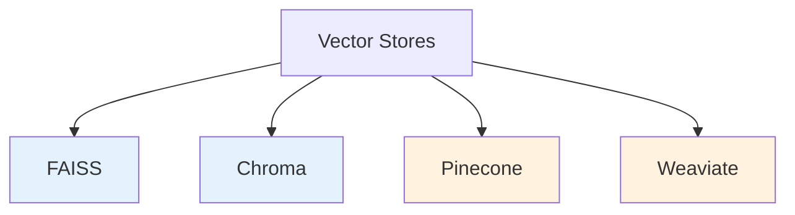
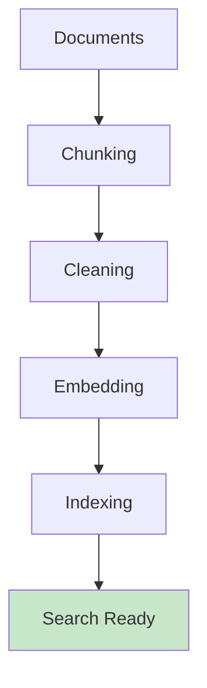
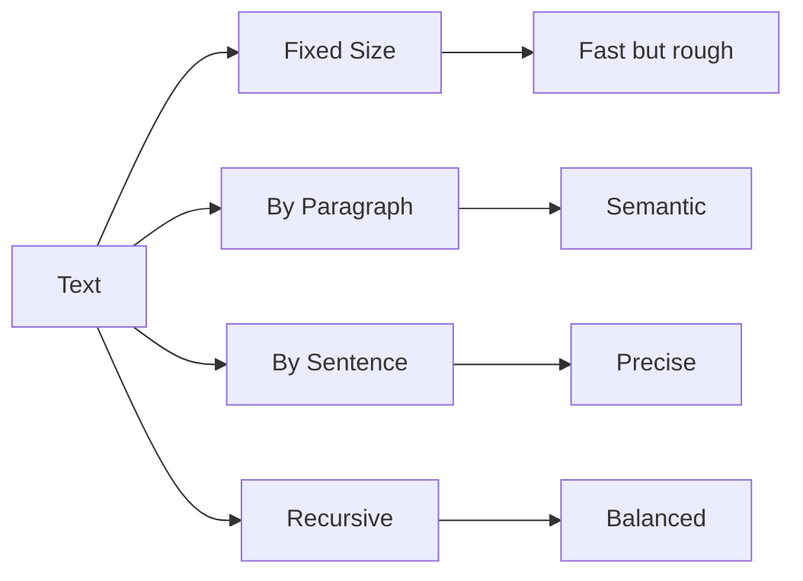
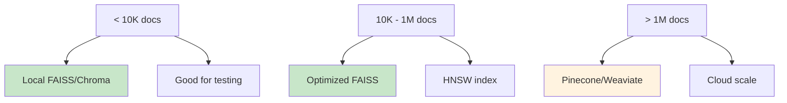

# Vector Storage

Deep dive into vector databases and storage strategies.

## Vector Store Options



| Store | Type | Best For |
|-------|------|----------|
| FAISS | Local | Quick tests, small data |
| Chroma | Local | Prototyping |
| Pinecone | Cloud | Production scale |
| Weaviate | Hybrid | Flexible schemas |

## Indexing Flow



## FAISS Example

```python
import faiss
import numpy as np

# Create index
dimension = 384  # Embedding size
index = faiss.IndexFlatL2(dimension)

# Add vectors
embeddings = np.array(all_embeddings).astype('float32')
index.add(embeddings)

# Search
query_embedding = np.array([query_vec]).astype('float32')
distances, indices = index.search(query_embedding, k=5)
```

## Chroma Example

```python
import chromadb

client = chromadb.Client()
collection = client.create_collection("knowledge")

collection.add(
    ids=["1", "2", "3"],
    embeddings=embeddings,
    documents=["doc1 text", "doc2 text", "doc3 text"]
)

results = collection.query(
    query_embeddings=[query_vec],
    n_results=3
)
```

## Performance Comparison

| Metric | FAISS | Chroma | Pinecone |
|--------|-------|--------|----------|
| Speed | Fast | Medium | Fast |
| Scale | Millions | Thousands | Unlimited |
| Setup | Local | Local | Cloud |
| Cost | Free | Free | Paid |

## Chunking Strategies



## Best Practices

| Tip | Reason |
|-----|--------|
| 500-1000 token chunks | Balance context & precision |
| 30-50 token overlap | Catch cross-chunk info |
| Clean before indexing | Better embeddings |
| Use same embedder | Consistent search |
| Filter by metadata | Precision boost |

## Scaling Strategy



## Next Steps

- [MLOps](../mlops/index.md) - Production pipelines
- [Enterprise Apps](../enterprise-apps/index.md) - Scale deployment