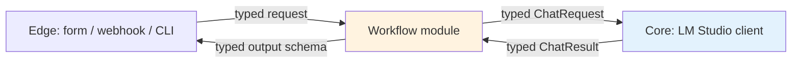

# Reference — Python API

> **Audience:** engineers integrating a Workflow module into their own application, or extending an existing module with a new output type. If you only want to **use** the system, the [CLI](cli.md) is the higher-level entry point.

This page documents the typed contracts every module in this project exposes. Everything that crosses a layer boundary (see [Architecture: data flow](../architecture/data-flow.md)) is a Pydantic model — not a free-form string. The contracts here are the single source of truth for what those models look like.

---

## The typed contracts

The five-layer architecture has three boundaries where typed objects cross:



The `Core` boundary is owned by this project (the LM Studio client wrapper). The `Workflow` boundary is what each module package exposes. The `Edge` boundary is what your application code consumes.

You almost never need to construct a `ChatRequest` yourself. The `Core` wrapper does it. You do construct `ChatResult` consumers (validators) and you do construct `TriageRequest` / `RAGRequest` / `ShiftNote` at the application boundary.

---

## The LM Studio client

> **Source:** `aiwf.core.lm_studio`
> **Stability:** stable (the `ChatRequest` and `ChatResult` shapes are frozen and versioned).

### `ChatRequest`

The object the Workflow layer hands to the Core layer to call the model.

```python
from pydantic import BaseModel, Field
from typing import Literal

class ChatRequest(BaseModel):
    messages: list[dict[str, str]]   # [{"role": "system|user|assistant", "content": "..."}]
    temperature: float = Field(0.0, ge=0.0, le=2.0)
    max_tokens: int = Field(512, ge=1, le=4096)
    stop: list[str] | None = None
    seed: int | None = None          # for reproducible eval
    response_format: Literal["text", "json_object"] = "text"
```

The `messages` list is OpenAI-compatible: each message has a `role` (`system` / `user` / `assistant`) and a `content` string. The Workflow layer is responsible for building the list (system prompt + user content + optional few-shot examples).

### `ChatResult`

The object the Core layer returns to the Workflow layer.

```python
class TokenUsage(BaseModel):
    prompt_tokens: int
    completion_tokens: int
    total_tokens: int

class ChatResult(BaseModel):
    content: str                            # raw model text
    finish_reason: Literal["stop", "length", "error"]
    usage: TokenUsage
    model_id: str                           # e.g. "qwen2.5-1.5b-instruct"
    latency_ms: int                         # wall-clock for the HTTP call
    request_id: str                         # for audit log correlation
```

The raw `content` is what the model returned. **It is not yet safe to use.** The Workflow layer must run it through a validator (JSON parse, Pydantic validate, containment check, etc.) before exposing it to the Edge.

### `LMStudioClient`

```python
from aiwf.core.lm_studio import LMStudioClient, ChatRequest, ChatResult

client = LMStudioClient(
    base_url="http://localhost:1234/v1",  # default
    timeout_s=10.0,                       # default
    max_retries=2,                        # default; only on 5xx and connection errors
    healthcheck_on_init=True,             # default; raises if LM Studio is unreachable
)

result: ChatResult = client.chat(ChatRequest(
    messages=[{"role": "user", "content": "Classify this ticket…"}],
    temperature=0.0,
    max_tokens=256,
    response_format="json_object",
    seed=42,
))
```

**Error semantics.** The client raises on transport / 5xx / 4xx (other than 429). It does **not** raise on a 200 with a refusal — those come back as `finish_reason="stop"` with whatever `content` the model produced. The validator is responsible for handling refusals.

**Retries.** Retries are bounded (default 2) and only fire on connection errors, 5xx, and 429 with `Retry-After`. The client does **not** retry on 4xx (other than 429) — those are caller errors.

**Health check.** `healthcheck_on_init=True` calls `/v1/models` once at construction. If LM Studio is unreachable, the client raises `LMStudioUnreachable` at import time of your application, not on the first request. This is a deliberate choice — fail at boot, not in the middle of a request.

---

## The Workflow.run() contract

Every module package (`isp_classifier`, `sla_system`, `qwen_rag`, `factory_summary`, etc.) exposes one top-level function with this signature:

```python
from aiwf.core.types import ModuleMeta

def run(request: <ModuleInput>, *, actor: Actor, request_id: str) -> <ModuleOutput>:
    """Run the module on a request. Pure (no I/O outside the LM Studio call)."""
```

The `run()` contract is the same for every module. The **types** are what differ per module.

### Common types

```python
from pydantic import BaseModel
from datetime import datetime

class Actor(BaseModel):
    user_id: str               # who is asking
    tenant_id: str             # multi-tenant boundary
    role: str                  # "operator", "service", "system"

class ModuleMeta(BaseModel):
    """Attached to every module output for audit and debugging."""
    module_name: str           # "sla_system.classifier"
    module_version: str        # semver
    request_id: str
    started_at: datetime
    finished_at: datetime
    model_id: str
    usage: TokenUsage
    latency_ms: int
```

`ModuleMeta` is **always** included in the module's output as a sibling field (e.g., `result.meta`). The audit log reads it; the test harness reads it; the on-call engineer reads it at 2am.

### `run()` is pure

`run()` does no I/O other than the call to `LMStudioClient.chat()`. It does not read environment variables, it does not touch the filesystem, it does not open a database connection, and it does not log. All of those are the application's job.

This is the property that makes `run()` testable with a stub client and reproducible across machines.

---

## The module contracts

Each module's input and output types. The module name in parentheses is the Python import path.

### `sla_system.classifier` — tier-1 complaint triage

```python
class TriageRequest(BaseModel):
    subject: str
    body: str
    customer_tier: Literal["platinum", "gold", "silver"]
    timestamp: datetime | None = None   # for SLA calculations

class TriageOutput(BaseModel):
    category: Literal[
        "connectivity", "hardware", "billing",
        "service_request", "complaint", "outage", "other"
    ]
    priority: Literal["P1", "P2", "P3"]
    suggested_owner: str                # queue name or role
    confidence: float                   # 0.0 to 1.0
    rationale: str                      # one sentence; cited from the model output

class TriageResult(BaseModel):
    output: TriageOutput
    meta: ModuleMeta
```

**Source.** Used by the [ISP support case study](../case-studies/isp-support.md).

### `qwen_rag.answer` — RAG over an internal corpus

```python
class RAGRequest(BaseModel):
    question: str
    corpus_id: str                      # which ChromaDB collection
    top_k: int = 4
    min_score: float = 0.0              # cosine threshold; below → "I don't know"
    require_citation: bool = True       # if True, the answer MUST include a citation_id

class Citation(BaseModel):
    chunk_id: str                       # must be in the retrieved set
    source_doc: str                     # filename or SOP id
    version: str                        # semver or date

class RAGOutput(BaseModel):
    answer: str
    citations: list[Citation]           # 1..top_k, in order of relevance
    retrieval_trace: list[str]          # chunk_ids the model saw, for audit

class RAGResult(BaseModel):
    output: RAGOutput
    meta: ModuleMeta
```

**Validation rules** (enforced by the module's output validator, not by the type system):

- Every `citation.chunk_id` must appear in `retrieval_trace`. The validator raises `CitationNotInRetrieval` on violation.
- If `require_citation=True` and `citations` is empty, the result is replaced with a "I don't have that information" response (the CISO bar from the [bank case study](../case-studies/bank-it.md)).
- If the model's `answer` contains a phrase not found in the union of retrieved chunks, the result is rejected and re-prompted once. On second failure, the request is flagged for human review.

**Source.** Used by the [bank IT case study](../case-studies/bank-it.md).

### `factory_summary.summarize` — shift handover summarization

```python
class ShiftNote(BaseModel):
    line: Literal["L1", "L2"]
    shift: Literal["morning", "afternoon", "night"]
    raw_text: str                       # the line leader's note
    written_at: datetime
    author_id: str

class MachineIssue(BaseModel):
    machine_id: str
    severity: Literal[1, 2, 3]         # 1 = cosmetic, 2 = needs attention, 3 = safety
    note: str

class ShiftSummary(BaseModel):
    line: Literal["L1", "L2"]
    shift: Literal["morning", "afternoon", "night"]
    machine_issues: list[MachineIssue]
    qa_defects: list[str]
    safety_incidents: list[str]
    focus_for_next_shift: str

class SummaryResult(BaseModel):
    output: ShiftSummary
    meta: ModuleMeta
    validated: bool                     # False → went to human review
```

**Validation rule (containment check).** For every non-empty field in `ShiftSummary`, the validator must find a substring in `ShiftNote.raw_text`. If a phrase in the summary does not appear in the input, the summary is rejected and re-prompted once. On second failure, the note is flagged for human review and `validated=False`.

This is the strongest single defence against hallucination for summarization tasks, and it is what produced the 0% hallucinated-field rate in the [factory case study](../case-studies/factory-it.md).

---

## The application boundary

At the application layer, you do not call `run()` directly. You call the CLI or the FastAPI service.

### FastAPI

```python
# main.py
from fastapi import FastAPI, Depends
from aiwf.core.actor import get_actor
from sla_system.classifier import run, TriageRequest, TriageResult
from aiwf.core.audit import log_module_call

app = FastAPI()

@app.post("/triage", response_model=TriageResult)
def triage(req: TriageRequest, actor: Actor = Depends(get_actor)):
    request_id = new_request_id()
    result = run(req, actor=actor, request_id=request_id)
    log_module_call(actor, request_id, result)
    return result
```

The `get_actor` dependency reads the authenticated user from the request (JWT, mTLS, or whatever your auth layer is). The `log_module_call` function writes the audit row (see [conventions](conventions.md)).

### Direct (tests only)

```python
from unittest.mock import patch
from sla_system.classifier import run, TriageRequest

req = TriageRequest(subject="...", body="...", customer_tier="platinum")

with patch("sla_system.classifier.client") as mock_client:
    mock_client.chat.return_value = ChatResult(content='{"category": "connectivity", ...}', ...)
    result = run(req, actor=test_actor, request_id="test-1")
```

Direct calls are for unit tests. Production code goes through the FastAPI service or the CLI.

---

## Versioning

The contract is versioned in two places:

1. **The Python package version.** `aiwf.core` is on semver. A breaking change to `ChatRequest` / `ChatResult` is a major version bump.
2. **The `ModuleMeta.module_version` field.** Each module has its own semver. A breaking change to a module's input or output types is a major version bump for that module.

A module at `1.4.2` is expected to remain call-compatible with `aiwf.core` at `1.x` and `2.x`. A module at `2.0.0` may require `aiwf.core` at `2.x`.

The audit log records both versions on every call. This is what lets you roll out a new module version and roll back if the eval set shows a regression.

---

## 7. See also

- [Architecture: data flow](../architecture/data-flow.md) — the seams between layers, including a sequence diagram of the full call
- [Reference: CLI](cli.md) — the higher-level entry point for `aiwf` subcommands
- [Reference: prompts](prompts.md) — the exact system prompts for each module
- [Reference: conventions](conventions.md) — file layout, env vars, log format
- [Reference: benchmarks](benchmarks.md) — the frozen eval sets each module is measured against
- [Case study: ISP support](../case-studies/isp-support.md) — `TriageRequest` / `TriageResult` in production
- [Case study: bank IT](../case-studies/bank-it.md) — `RAGRequest` / `RAGResult` in production
- [Case study: factory IT](../case-studies/factory-it.md) — `ShiftNote` / `ShiftSummary` in production
