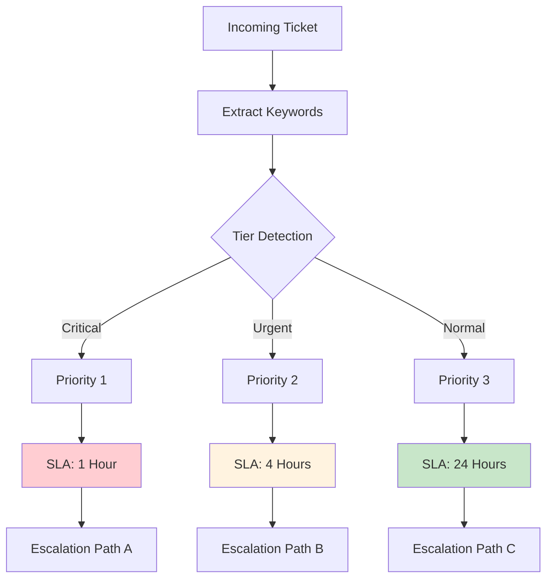

# SLA Classifier

Automated classification of tickets based on Service Level Agreement tiers.

## Classification Flow



## Classification Criteria

### Priority 1 - Critical (1 Hour SLA)
- Complete service outage
- Security breach
- Multiple affected customers

### Priority 2 - Urgent (4 Hour SLA)
- Partial service degradation
- Single customer critical issue
- Performance degradation

### Priority 3 - Normal (24 Hour SLA)
- General inquiries
- Feature requests
- Minor issues

## Implementation

```python
def classify_sla_tier(ticket_text):
    # Critical keywords
    if any(kw in ticket_text.lower() for kw in ['outage', 'down', 'breach']):
        return "P1", "1h"
    
    # Urgent keywords
    if any(kw in ticket_text.lower() for kw in ['slow', 'degraded', 'intermittent']):
        return "P2", "4h"
    
    # Default to normal
    return "P3", "24h"
```