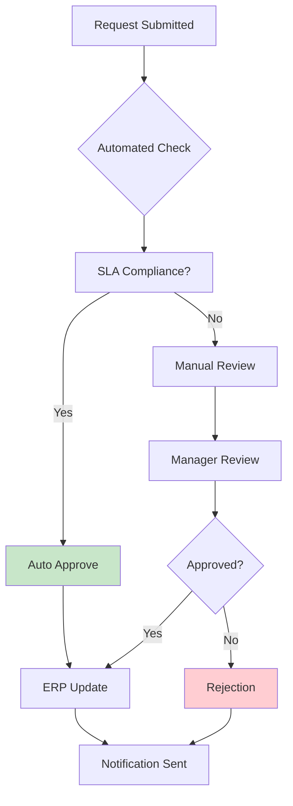
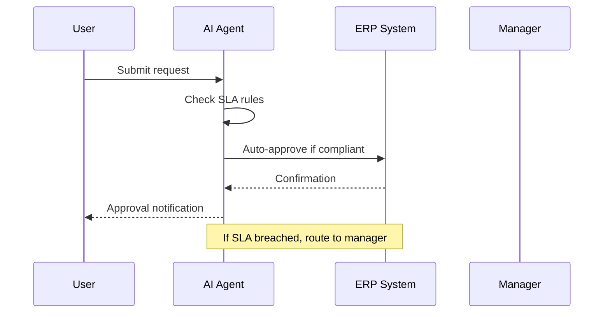

# ERP Approval System

Automated approval workflow integrated with enterprise resource planning.

## Approval Flow

## Integration Architecture

## Decision Matrix

| Condition | Action |
|-----------|--------|
| SLA Compliant + Valid | Auto Approve |
| SLA Breached | Route to Manager |
| Invalid Request | Reject with Reason |
| Partial Data | Request More Info |

## Benefits

- **Faster Processing**: Instant approvals for compliant requests
- **Consistent Decisions**: Rule-based evaluation
- **Audit Trail**: Complete documentation of decisions