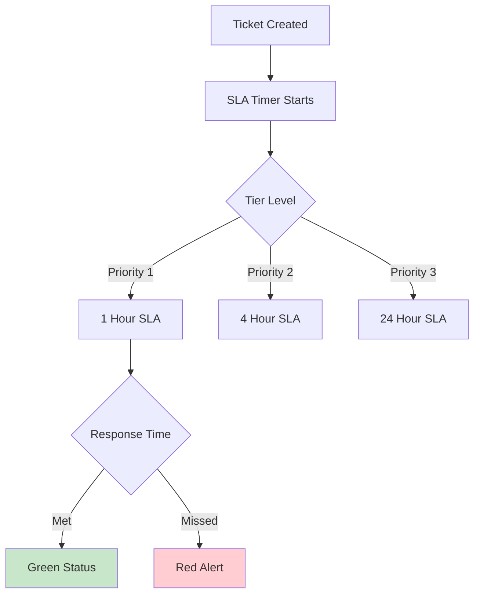

# SLA System

Service Level Agreement monitoring and automated approval system for ISP operations.

## System Overview

## Features

- **Automated Monitoring**: Real-time SLA tracking
- **Escalation Alerts**: Automatic escalation when SLA at risk
- **ERP Integration**: Auto-approval based on SLA compliance

## Components

| Component | Description |
|-----------|-------------|
| SLA Classifier | Categorizes tickets by SLA tier |
| ERP Approval | Automated approval workflow |
| Dashboard | Real-time monitoring interface |

## Quick Links

- [SLA Classifier](classifier.md) - Ticket classification by SLA
- [ERP Approval](erp-approval.md) - Automated approval system