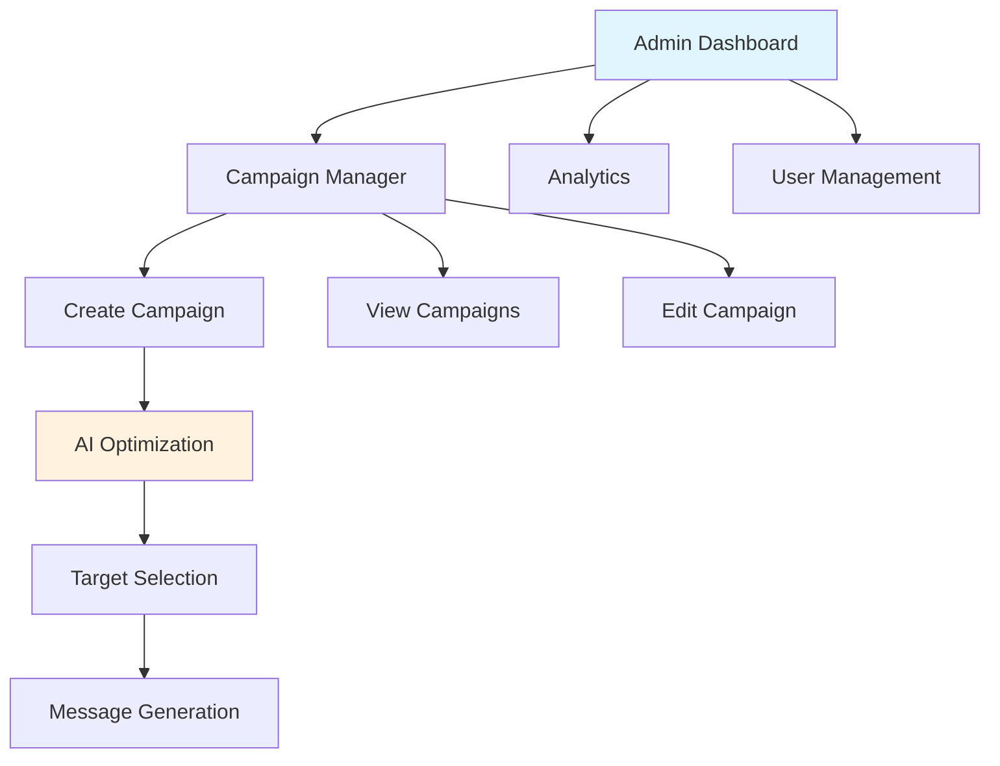
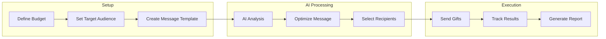

# Smart Gift AI

AI-powered admin panel for Smart Gift promotional campaigns.

## System Architecture

## AI Features

- **Smart Targeting**: AI identifies best recipient segments
- **Personalized Messages**: Customized gift recommendations
- **Performance Prediction**: Forecast campaign success

## Campaign Flow

